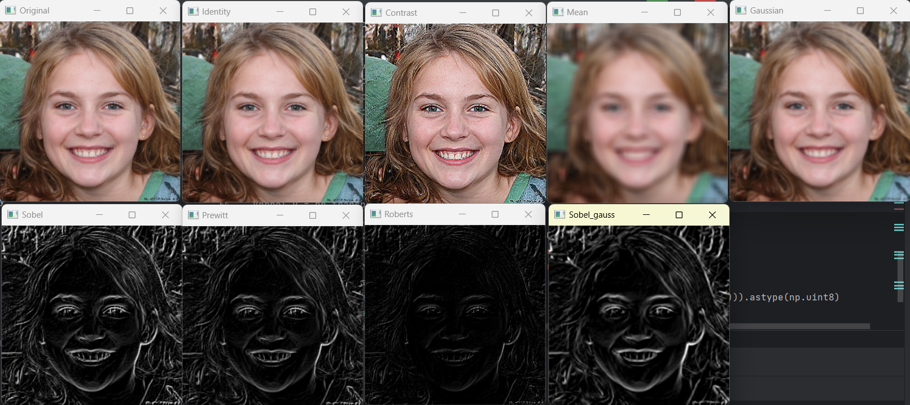

# Wybrane metody przetwarzania sygnałów cyfrowych (a w szczególności obrazów cyfrowych ( ͡° ͜ʖ ͡°) ), które wykorzystywane są w deep learning oraz wirtualnej rzeczywistości

[Tomasz Hachaj](https://home.agh.edu.pl/~thachaj/)

Na tym wykładzie omówimy najistotniejsze dla tego kursu metody przetwarzania sygnałów cyfrowych i wykorzystanie wybranych z nich w deep learning. 

[1. Obraz cyfrowy](#obraz-cyfrowy)

[2. Filtracja sygnału](#filtracja-sygnału)

[2.1 Filtry splotowe](#filtry-splotowe)

[2.2 Transpozycja splotu (transposed convolution)](#transpozycja-splotu-transposed-convolution)

[2.3 Przekształcenia morfologiczne](#przekształcenia-morfologiczne)

[2.4 Filtracja medianowa](#filtracja-medianowa)

[2.5 Szkieletyzacja](#szkieletyzacja)

[2.6 Wypełnianie pustych przestrzeni](#wypełnianie-pustych-przestrzeni)

[2.7 Etykietowanie (labelling) oraz segmetnacja metodą działów wodnych (watershed segmentation)](#etykietowanie-labelling-oraz-segmetnacja-metodą-działów-wodnych-watershed-segmentation)

[2.8 Filtracja w domenie częstotliwości - filtr Butterwortha](#filtracja-w-domenie-częstotliwości---filtr-butterwortha)

[3. Kamera jednoobiektywowa i kamera stereowizyjna](#kamera-jednoobiektywowa-i-kamera-stereowizyjna)

[3.1 Kalibracja kamery](#kalibracja-kamery)

[3.2 Stereowizja](#stereowizja)

[Dodatkowa warto przeczytać](#dodatkowa-warto-przeczytać)

[Literatura](#literatura)


## Obraz cyfrowy

W zagadnieinu cyfrowego przetwarzania sygnałów, obraz I najczęściej reprezentowany jest w postaci wielowymiarowej tablicy, której wymiary odzwierciedlają rozdzielczość obrazu. Obraz skwantowany jest do pikseli, do każdego piksela przypisane jest jeden lub więcej wartości informujących na przykład o kolorze obiektu, który reprezentuje dany piksel, informacja o klasie semantycznej będącej wynikiem segmentacji obrazu, odległości obiektu do którego należy piksel od kamery (w wypadku obrazów odległości depth image) itp.

W wypadku obrazów kolorowych często wykorzystuje się dwie rprezentacje kolorów: RGB (red, green, blue) oraz HSI (hue, saturation, intensity).


Rysunek 1. Reprezentacja koloru w przestrzeni RGB. Źródło rysunku: Distante, A., Distante, C., Distante, W., & Wheeler. (2020). Handbook of image processing and computer vision. Gemany: Springer International Publishing.

Reprezentacja koloru w przestrzeni RGB (lub BGR) najczęściej odpowiada bezpośrednio sposobowi, w jaki kodowany jest obraz przed przekazywaniem go do wizualizacji na wyświetlaczach cyfrowych, dlatego jest zazwyczaj domyślnym formatem używanym przy wczytywaniu i zapisywaniu danych obrazowych. Również wiele algorytmów deep learning pracuje na danych wejściowych w formacie RGB/BGR.

Przestrzeń kolorów HSV modeluje sposób, w jaki ludzki układu wzrokowy
postrzega kolory, czyli przy pomocy barwy (hue), nasycenia (saturation) i jasności (intensywności, value). 

Barwa H jest powiązana z dominującą długością fali (koloru) obserwowanego widmowego rozkładu światła, o którym wiemy, że jest mieszaniną światła elementy o różnych długościach fal. 


Nasycenie S wskazuje pomiar względnej czystości koloru, to znaczy ilości połączonego światła białego (mieszanego) z odcieniem H. Nasycenie
wartość jest odwrotnie proporcjonalna do ilości białego koloru użytego do rozcieńczenia bazy kolor intensywny (maksymalne nasycenie odpowiada brakowi rozcieńczenia bielą).

Wartość intensywności V wskazuje poziom jasności obiektu, ale nie obejmuje
informacje o kolorze.


Rysunek 2. Reprezentacja koloru w przestrzeni HSI. Źródło rysunku: Distante, A., Distante, C., Distante, W., & Wheeler. (2020). Handbook of image processing and computer vision. Gemany: Springer International Publishing.


Aby przekształcić obraz RHB na HSI wykonujemy następujące obliczenia:

```python

# zgodnie z biblioteką colorsys
def rgb_to_hsv(r, g, b):
    maxc = max(r, g, b)
    minc = min(r, g, b)
    v = maxc
    if minc == maxc:
        return 0.0, 0.0, v
    s = (maxc-minc) / maxc
    rc = (maxc-r) / (maxc-minc)
    gc = (maxc-g) / (maxc-minc)
    bc = (maxc-b) / (maxc-minc)
    if r == maxc:
        h = bc-gc
    elif g == maxc:
        h = 2.0+rc-bc
    else:
        h = 4.0+gc-rc
    h = (h/6.0) % 1.0
    return h, s, v

```

Konwersja HSV na RGB dokonuje się w następujący sposób:

```python

# zgodnie z biblioteką colorsys
def hsv_to_rgb(h, s, v):
    if s == 0.0:
        return v, v, v
    i = int(h*6.0) # XXX assume int() truncates!
    f = (h*6.0) - i
    p = v*(1.0 - s)
    q = v*(1.0 - s*f)
    t = v*(1.0 - s*(1.0-f))
    i = i%6
    if i == 0:
        return v, t, p
    if i == 1:
        return q, v, p
    if i == 2:
        return p, v, t
    if i == 3:
        return p, q, v
    if i == 4:
        return t, p, v
    if i == 5:
        return v, p, q


```

Przykładowe wyniki konwersji RGB na HSV, które łątwo zrozumieć :-)

```python

import colorsys
print(colorsys.rgb_to_hsv(0,0,0)) # czarny
print(colorsys.rgb_to_hsv(1,0,0)) # czerwony
print(colorsys.rgb_to_hsv(0,1,0)) # zielony
print(colorsys.rgb_to_hsv(0,0,1)) # niebieski
print(colorsys.rgb_to_hsv(1,1,1)) # biały
print(colorsys.rgb_to_hsv(0.5,0,0)) # ciemno-czerwony

```

Należy pamiętać, że choć obecnym standardem reprezentacji kolorów jest w palecie RGB jest zapisywanie koloru czerwonego na pierwszej pozycji, to jedna z najpopularniejszych bibliotek do przetwarzania obrazów OpenCV używa kolejności BGR. Przed użyciem jakiegoś pretrenowanego (gotowego) modelu machine learning pracującego na danych orbazowych, warto sprawdzić w jego dokumentaci, z jaką faktycznie kolejnością kolorów mamy do czynienia.

Nie zawsze nasz algorytm potrzebuje danych o kolorach, pominięie ich może znacząco zmniejszyć rozmiar modelu deep learning i przyspieszyć obliczenia. Często więc dokonuje się konwersji obrazu na skalę szarości. Najczęstrze podejścia:

$Gray \gets \frac{R + G + B}{3}$

lub biorąc pod uwagę percepcję kolorów przez ludzkiego oko zgodnie z [OpenCV](https://docs.opencv.org/3.4/de/d25/imgproc_color_conversions.html):

$Gray \gets 0.299 \cdot R + 0.587 \cdot G+ 0.114 \cdot B$

lub można na przykład wykorzystać składową V z modelu HSV.

```python

import cv2
img = cv2.imread('person.jpg')
img = cv2.resize(img, [256, 256])
cv2.imshow('person', img)
cv2.imshow('B', img[:,:,0])
cv2.imshow('G', img[:,:,1])
cv2.imshow('R', img[:,:,2])
grayscale = cv2.cvtColor(img, cv2.COLOR_BGR2GRAY)
cv2.imshow('grayscale OpenCV', grayscale)
img_hsv = cv2.cvtColor(img, cv2.COLOR_BGR2HSV)
cv2.imshow('H', img_hsv[:,:,0])
cv2.imshow('S', img_hsv[:,:,1])
cv2.imshow('V', img_hsv[:,:,2])
import numpy as np
img_float = img.astype(float)
cv2.imshow('grayscale mean', (img_float[:,:,0] + img_float[:,:,1] + img_float[:,:,2]) / (255 * 3))
cv2.waitKey()

```


## Filtracja sygnału

Filtracja sygnału ma na celu uwypuklenie pewnych cech sygnału kosztem wytłumienia innych cech sygnału. Należy pamiętać, że jeśli nie używamy metod generatywnych (tworzących nowe dane na podstawie pewnych danych wejściowych) filtry nie-generatywne nie są operacją, która uwidoczni dane, których w sygnale nie ma.

### Filtry splotowe

Filtr splotowy (konwolucyjny) wykorzystuje numeryczną interpretacją operatora splotu funkcji.

$f  \bigotimes g =  \int_{-\infty }^{\infty}f(t-\tau ) \cdot g(\tau) d \tau$

W przypadku dwuwymiarowym:

$u  \bigotimes v =  \int_{-\infty }^{\infty}\int_{-\infty }^{\infty}u(t-\tau_{1}, t-\tau_{2}) \cdot v(\tau_{1},\tau_{2}) d \tau_{1} d \tau_{2}$


Filtr splotowy jest przykładem filtra liniowego. Przy jego pomocy można zrealizować szereg użytecznych przekształceń obrazów takich jak różniczkowanie numeryczne, detektory krawędzi, rozmywanie (uśrednianie) pikseli obrazu, rozmywanie Gaussa, polepszanie kontrastu i różnego typu  ekstraktory cech, stosowane w sieciach konwolucyjnych.

Poniższy kod prezentuje przykładowe filtry rozmywające (dolnoprzepustowe), filtr wyostrzający kontrast oraz detektory krawędzi. Zwróćmy uwagę, że jeśli nie chcemy, aby jasność obrazu uległa zmiane, suma współczynników w filtrze musi wynosić 1. W wypadku detektorów krawędzi suma współczynników w filtrze wynosi 0.

```python

import cv2
import numpy as np

image = cv2.imread('person.jpg')
image = cv2.resize(image, [256, 256])
cv2.imshow('Original', image)
##############################################
kernel1 = np.array([[0, 0, 0],
                    [0, 1, 0],
                    [0, 0, 0]])
identity = cv2.filter2D(src=image, ddepth=-1, kernel=kernel1)
cv2.imshow('Identity', identity)
##############################################
kernel1 = np.array([[0, -1, 0],
                    [-1, 5, -1],
                    [0, -1, 0]])
identity = cv2.filter2D(src=image, ddepth=-1, kernel=kernel1)
cv2.imshow('Contrast', identity)
##############################################
kernel1 = np.array([[0, 0, 0],
                    [0, 1, 0],
                    [0, 0, 0]])
identity = cv2.filter2D(src=image, ddepth=-1, kernel=kernel1)
cv2.imshow('Identity', identity)
##############################################
kernel1 = 1/81 * np.ones((9, 9))
mean_conv = cv2.filter2D(src=image, ddepth=-1, kernel=kernel1)
cv2.imshow('Mean', mean_conv)
##############################################
img=np.zeros((7,7))
img[3,3]=1
kernel1 = cv2.GaussianBlur(img, (5, 5), 0)
gaussian_conv = cv2.filter2D(src=image, ddepth=-1, kernel=kernel1)
cv2.imshow('Gaussian', gaussian_conv)
##############################################
kernel_x = np.array([[1,2,1],[0,0,0],[-1,-2,-1]])
kernel_y = np.transpose(kernel_x)
image_gray = cv2.cvtColor(image, cv2.COLOR_BGR2GRAY)
sobel_x = cv2.filter2D(src=image_gray, ddepth=-1, kernel=kernel_x).astype(float)
sobel_y = cv2.filter2D(src=image_gray, ddepth=-1, kernel=kernel_y).astype(float)
my_sobel = np.sqrt(sobel_x ** 2 + sobel_y ** 2)
my_sobel = (255 * (my_sobel - np.min(my_sobel))/ (np.max(my_sobel) - np.min(my_sobel))).astype(np.uint8)
cv2.imshow('Sobel', my_sobel)
##############################################
kernel_x = np.array([[1,1,1],[0,0,0],[-1,-1,-1]])
kernel_y = np.transpose(kernel_x)
image_gray = cv2.cvtColor(image, cv2.COLOR_BGR2GRAY)
prewitt_x = cv2.filter2D(src=image_gray, ddepth=-1, kernel=kernel_x).astype(float)
prewitt_y = cv2.filter2D(src=image_gray, ddepth=-1, kernel=kernel_y).astype(float)
my_prewitt = np.sqrt(prewitt_x ** 2 + prewitt_y ** 2)
my_prewitt = (255 * (my_prewitt - np.min(my_prewitt))/ (np.max(my_prewitt) - np.min(my_prewitt))).astype(np.uint8)
cv2.imshow('Prewitt', my_prewitt)
##############################################
kernel_x = np.array([[1,0],[0,-1]])
kernel_y = np.transpose(kernel_x)
image_gray = cv2.cvtColor(image, cv2.COLOR_BGR2GRAY)
roberts_x = cv2.filter2D(src=image_gray, ddepth=-1, kernel=kernel_x).astype(float)
roberts_y = cv2.filter2D(src=image_gray, ddepth=-1, kernel=kernel_y).astype(float)
my_roberts = np.sqrt(roberts_x ** 2 + roberts_y ** 2)
my_roberts = (255 * (my_roberts - np.min(my_roberts))/ (np.max(my_roberts) - np.min(my_roberts))).astype(np.uint8)
cv2.imshow('Roberts', my_roberts)
##############################################
kernel_x = np.array([[1,2,1],[0,0,0],[-1,-2,-1]])
kernel_y = np.transpose(kernel_x)
blurred_image = cv2.GaussianBlur(image, (5, 5), 0)
image_gray = cv2.cvtColor(blurred_image, cv2.COLOR_BGR2GRAY)
sobel_x = cv2.filter2D(src=image_gray, ddepth=-1, kernel=kernel_x).astype(float)
sobel_y = cv2.filter2D(src=image_gray, ddepth=-1, kernel=kernel_y).astype(float)
my_sobel = np.sqrt(sobel_x ** 2 + sobel_y ** 2)
my_sobel = (255 * (my_sobel - np.min(my_sobel))/ (np.max(my_sobel) - np.min(my_sobel))).astype(np.uint8)
cv2.imshow('Sobel_gauss', my_sobel)
##############################################
cv2.waitKey()

```



https://learnopencv.com/image-filtering-using-convolution-in-opencv/

Warstwy splotowe (konwolucyjne) stosowane są również w zastosowaniach deep learning jako ekstraktory cech. Poniżej przedstawiony jest przykład użycia filtru splutowego w bibliotece Keras.

```python

import keras
import numpy as np
import cv2
img = cv2.imread('person.jpg')
img = cv2.resize(img, [256, 256])
img = cv2.cvtColor(img, cv2.COLOR_BGR2GRAY).astype(float) / 255
x = np.expand_dims(img, axis=0)

model = keras.Sequential(
    [
        keras.layers.Input(shape=(256,256,1)),
        keras.layers.Conv2D(1, 3, activation=None)
    ]
)
model.compile()
model.summary()

# half of the Sobel filter
kernel = np.array([[1, 2, 1], [0, 0, 0], [-1, -2, -1]])
#kernel = np.array([[1, 2, 1], [0, 0, 0], [-1, -2, -1]])
kernel = np.transpose(kernel)
kernel = np.expand_dims(kernel, axis=-1)
kernel = np.expand_dims(kernel, axis=-1)
ww = model.layers[0].get_weights()
ww[0] = kernel
model.layers[0].set_weights(ww)
##print(ww.shape)
y = model(x)[0]
yy = y[:,:,0].numpy()
yy = (255 * (yy - np.min(yy))/ (np.max(yy) - np.min(yy))).astype(np.uint8)
cv2.imshow('x', x[0])
cv2.imshow('y',yy)
cv2.waitKey()

```


### Transpozycja splotu (transposed convolution)

Operacja transpozycji splotu używana jest często w tych elementach sieci neuronowej, w której następuje zwiększenia rozdzielczości przetwarzanego sygnału (na przykład w dekoderach sieci typu koder-dekoder). Działanie transpozycji splotu przedstawione jest na poniższym rysunku.


Źródło rysunku [link](https://towardsdatascience.com/understand-transposed-convolutions-and-build-your-own-transposed-convolution-layer-from-scratch-4f5d97b2967)

Przykłady z powyższego rysunku można rozpisać tak jak poniżej:

Dla kroku równego 1:

$ \begin{bmatrix}
55 & 52 & \\
57 & 50 & \\
 &  & \\
\end{bmatrix} + \begin{bmatrix}
 & 110 & 104 \\
 & 114 & 100 \\
 &  &  
\end{bmatrix} + \begin{bmatrix}
 & & \\
110 & 104 & \\
114 & 100 &  
\end{bmatrix}+ \begin{bmatrix}
 & & \\
 & 55 & 52\\
 & 57 &50  
\end{bmatrix}=\begin{bmatrix}
55 & 162 & 104\\
167 & 323 & 152\\
114 & 157 & 50\end{bmatrix}$

Dla kroku równego 2:

$ \begin{bmatrix}
55 & 110 & & \\
110 & 55 & & \\
 &  & & \\
 &  & & \\
\end{bmatrix}+\begin{bmatrix}
 & & 52 & 104\\
 & & 104 & 52\\
 &  & & \\
 &  & & \\
\end{bmatrix}+\begin{bmatrix}
 & & & \\
 & & & \\
 57 & 114 & & \\
 114 & 57 & & \\
\end{bmatrix}+\begin{bmatrix}
 & & & \\
 & & & \\
  &  & 50 & 110\\
  & & 110 & 50\\
\end{bmatrix}=\begin{bmatrix}
55 & 110 & 52& 104\\
110 & 55 & 104 & 52\\
57  & 114 & 50 & 110\\
114  & 57 & 110 & 50\\
\end{bmatrix}$

Implementacja powyższych obliczeń w środowisku Keras wygląda następująco:

```python

from tensorflow import keras
import numpy as np

X = np.array([[55, 57], [52, 50]])
kernel = np.array([[1, 2], [2, 1]])
model_Conv2D = keras.models.Sequential()
model_Conv2D.add(keras.layers.Conv2DTranspose(1, (2, 2), strides=(1, 1), padding='valid', input_shape=(X.shape[0], X.shape[1], 1)))

kernel = np.expand_dims(kernel, axis=-1)
kernel = np.expand_dims(kernel, axis=-1)
weights = model_Conv2D.get_weights()
weights[0] = kernel
model_Conv2D.set_weights(weights)
X = np.expand_dims(X, axis=0)
y = model_Conv2D.predict(X)
print(y)

X = np.array([[55, 57], [52, 50]])
kernel = np.array([[1, 2], [2, 1]])
model_Conv2D = keras.models.Sequential()
model_Conv2D.add(keras.layers.Conv2DTranspose(1, (2, 2), strides=(2, 2), padding='valid', input_shape=(X.shape[0], X.shape[1], 1)))

kernel = np.expand_dims(kernel, axis=-1)
kernel = np.expand_dims(kernel, axis=-1)
weights = model_Conv2D.get_weights()
weights[0] = kernel
model_Conv2D.set_weights(weights)
X = np.expand_dims(X, axis=0)
y = model_Conv2D.predict(X)
print(y)

```


### Przekształcenia morfologiczne

Przekształcenia morfologiczne polegają na przekształceniu każdego piksela obrazu przy pomocy elementu strukturanego o zadanym kształcie (na przykład elpisy, koła, prostokąta). Jeśli mamy do czynienia z operatorem erozji, piksel znajdujący się w centrum elementu strukturalnego przybiera minimalną wartość spośród pikseli będących pod wpływem tego elementu strukturalnego. Jeśli mamy do czynienia z operatorem dylacji, piksel znajdujący się w centrum elementu strukturalnego przybiera maksymalną wartość spośród pikseli będących pod wpływem tego elementu strukturalnego.

Erozję i dylację można wykorzystać jako filtr minimalny i maksymalny.

Opracowano na podstawie [link](https://docs.opencv.org/4.x/d9/d61/tutorial_py_morphological_ops.html)

```python

import cv2
import numpy as np

img = cv2.imread('ludek.png', cv2.IMREAD_GRAYSCALE)
img = cv2.resize(img, (256,256))
ret,img = cv2.threshold(img,127,255,cv2.THRESH_BINARY)
#img = cv.imread('person.jpg', cv.IMREAD_GRAYSCALE)
#img = cv2.resize(img, (256,256))

cv2.imshow("original", img)
assert img is not None, "file could not be read, check with os.path.exists()"
#kernel = np.ones((5, 5), np.uint8)
kernel = cv2.getStructuringElement(cv2.MORPH_ELLIPSE,(5,5))
# wartosc minimalna
erosion = cv2.erode(img, kernel, iterations=1)
cv2.imshow("erosion", erosion)
# wartosc maksymalna
dilation = cv2.dilate(img,kernel,iterations = 1)
cv2.imshow("dilation", dilation)
# erosion + dilaton
opening = cv2.morphologyEx(img, cv2.MORPH_OPEN, kernel)
cv2.imshow("opening", opening)
# dilation + erosion
closing = cv2.morphologyEx(img, cv2.MORPH_CLOSE, kernel)
cv2.imshow("closing", closing)
# dilation - erosion
gradient = cv2.morphologyEx(img, cv2.MORPH_GRADIENT, kernel)
cv2.imshow("gradient", gradient)
# input image - opening
tophat = cv2.morphologyEx(img, cv2.MORPH_TOPHAT, kernel)
cv2.imshow("tophat", tophat)
#  closing - input image
blackhat = cv2.morphologyEx(img, cv2.MORPH_BLACKHAT, kernel)
cv2.imshow("blackhat", blackhat)
cv2.waitKey()

```


Przykładowy wynik dla obrazu czarno-białego.


Przykładowy wynik dla obrazu w odcieniach szarości.

### Filtracja medianowa

Filtracja medianowa działa w analogiczny sposób jak filtry konwolucyjne, jednak wartość piksela w centrum okna wyliczana jest jako mediana pikseli w oknie (nie jest więc to filtr liniowy).

```python

import cv2
img = cv2.imread('person.jpg')
img = cv2.resize(img, (256, 256))
cv2.imshow('original', img)
img_median = cv2.medianBlur(img, 3)
cv2.imshow('median 3', img_median)
img_median = cv2.medianBlur(img, 7)
cv2.imshow('median 7', img_median)
img_median = cv2.medianBlur(img, 15)
cv2.imshow('median 15', img_median)
cv2.waitKey()


```

Poniższy rysunek przedstawia wyniki działania kodu wykonującego fitlrację medianową. 


Przykładowe wyniki działania filtru medianowego z oknem o różnej wielkości.

Filtracja maksymalna i uśredniająca wykorzystywana jest również w sieciach neuronowych. Pełni zazwyczaj rolę warstwy zmniejszającej rozdzielczość obrazu.

```python

from tensorflow import keras
import numpy as np

X = np.array([[1, 2, 3, 4], [5, 6, 7, 8], [9, 10, 11, 12], [13, 14, 15, 16]])
model_Conv2D = keras.models.Sequential()
model_Conv2D.add(keras.layers.MaxPooling2D(pool_size=(2, 2), padding='valid', input_shape=(X.shape[0], X.shape[1], 1)))
X = np.expand_dims(X, axis=0)
y = model_Conv2D.predict(X)
print(y)
X = np.array([[1, 2, 3, 4], [5, 6, 7, 8], [9, 10, 11, 12], [13, 14, 15, 16]])
model_Conv2D = keras.models.Sequential()
model_Conv2D.add(keras.layers.AveragePooling2D(pool_size=(2, 2), padding='valid', input_shape=(X.shape[0], X.shape[1], 1)))
X = np.expand_dims(X, axis=0)
y = model_Conv2D.predict(X)
print(y)

```

Rezultaty działania powyższych warstw to :

$ \begin{bmatrix}
6 & 8 \\
14 & 16
\end{bmatrix}$ oraz 
$ \begin{bmatrix}
3.5 & 5.5 \\
11.5 & 13.5
\end{bmatrix}$

### Szkieletyzacja

Szkieletyzacja jest procesem przetworzenia obrazu cyfrowego w taki sposób, że wszystkie "grube linie" (takie, których grubość jest większa niż 1 piksel) zastępowane są przez linie centralne, które przez nie przechodzą. Przypomina to trochę zastępowanie obiektu przez reprezentujący go "szkielet"..

Popularnym algorytmem dokunującym szkieletyzacji jest algorytm Zhanga-Suena [link1](https://scikit-image.org/docs/stable/auto_examples/edges/plot_skeleton.html), [link2](https://github.com/linbojin/Skeletonization-by-Zhang-Suen-Thinning-Algorithm/blob/master/thinning.py), [link3](https://rosettacode.org/wiki/Zhang-Suen_thinning_algorithm).

Działanie algorytmu:

Załóżmy, że czarne piksele są jedynkami, a białe piksele zerami, a obraz wejściowy jest prostokątną tablicą N na M jedynek i zer.

Algorytm działa na wszystkich czarnych pikselach P1, które mogą mieć ośmiu sąsiadów. 

Sąsiedzi są uporządkowani w następujący sposób:

$ \begin{bmatrix}
P9 & P2 & P3\\
P8 & P1 & P4\\
P7 & P6 & P5
\end{bmatrix}$

Oczywiście piksele graniczne obrazu nie mogą mieć pełnych ośmiu sąsiadów

Zdefiniuj: A(P1) = liczba przejść od białego do czarnego (0 -> 1) w sekwencji: P2,P3,P4,P5,P6,P7,P8,P9,P2.

Zdefiniuj: B(P1)= Liczba czarnych pikseli sąsiadujących z P1. ( = suma(P2 .. P9) )

Krok 1 algorytmu

Wszystkie piksele są testowane, a piksele spełniające wszystkie poniższe warunki (jednocześnie) zapamiętywane.

1. Piksel jest czarny i ma ośmiu sąsiadów,
2. 2<=B(P1)<= 6,
3. A(P1) = 1,
4. Co najmniej jeden z P2, P4 i P6 jest biały,
5. Co najmniej jeden z P4, P6 i P8 jest biały.

Po iteracji i zebraniu wszystkich pikseli spełniające wszystkie warunki kroku 1, wszystkie te piksele są ustawiane na kolor biały.

Krok 2 algorytmu

Wszystkie piksele są ponownie testowane, a piksele spełniające wszystkie poniższe warunki zapamiętywane.

1. Piksel jest czarny i ma ośmiu sąsiadów,
2. 2<=B(P1)<= 6,
3. A(P1) = 1,
4. Co najmniej jeden z P2, P4 i P8 jest biały,
5. Co najmniej jeden z P2, P6 i P8 jest biały.

Po iteracji i zebraniu wszystkich pikseli spełniające wszystkie warunki kroku 2, wszystkie te piksele są ustawiane na kolor biały.

Powtarzaj dwa powyższe kroki naprzemiennie aż do momentu, kiedy oba kroki nie zmienią ani jednego piksela, wtedy zakończ algorytm.

```python

# https://scikit-image.org/docs/stable/auto_examples/edges/plot_skeleton.html
from skimage.morphology import skeletonize
from skimage import data
import matplotlib.pyplot as plt
from skimage.util import invert
import cv2

image = cv2.imread('sylwetki01.png', cv2.IMREAD_GRAYSCALE)
ret,image = cv2.threshold(image,127,255,cv2.THRESH_BINARY)
image = invert(image)

image2 = cv2.imread('sylwetki02.png', cv2.IMREAD_GRAYSCALE)
ret,image2 = cv2.threshold(image2,127,255,cv2.THRESH_BINARY)
image2 = invert(image2)

skeleton = skeletonize(image, method='zhang')
skeleton2 = skeletonize(image2, method='zhang')

fig, axes = plt.subplots(nrows=1, ncols=4, figsize=(8, 4), sharex=True, sharey=True)

ax = axes.ravel()

ax[0].imshow(image, cmap=plt.cm.gray)
ax[0].axis('off')
ax[0].set_title('original', fontsize=20)

ax[1].imshow(skeleton, cmap=plt.cm.gray)
ax[1].axis('off')
ax[1].set_title('skeleton', fontsize=20)

ax[2].imshow(image2, cmap=plt.cm.gray)
ax[2].axis('off')
ax[2].set_title('original2', fontsize=20)

ax[3].imshow(skeleton2, cmap=plt.cm.gray)
ax[3].axis('off')
ax[3].set_title('skeleton2', fontsize=20)

fig.tight_layout()
plt.show()

```

Zdjęcia pochodzą z Adobe Stock


Przykładowa implmentacja powyższego algorytmu [link](https://github.com/linbojin/Skeletonization-by-Zhang-Suen-Thinning-Algorithm/blob/master/thinning.py).

```python

"""
===========================
@Author  : Linbo<linbo.me>
@Version: 1.0    25/10/2014
This is the implementation of the
Zhang-Suen Thinning Algorithm for skeletonization.
===========================
"""
import matplotlib
import matplotlib.pyplot as plt
import skimage.io as io
import cv2
"load image data"
Img_Original = io.imread('sylwetki01.png')  # Gray image, rgb images need pre-conversion

"Convert gray images to binary images using Otsu's method"
from skimage.util import invert
Img_Original = cv2.imread('sylwetki01.png', cv2.IMREAD_GRAYSCALE)
ret,BW_Original = cv2.threshold(Img_Original,127,255,cv2.THRESH_BINARY)
BW_Original = invert(BW_Original)  # must set object region as 1, background region as 0 !
BW_Original = BW_Original / 255


def neighbours(x, y, image):
    "Return 8-neighbours of image point P1(x,y), in a clockwise order"
    img = image
    x_1, y_1, x1, y1 = x - 1, y - 1, x + 1, y + 1
    return [img[x_1][y], img[x_1][y1], img[x][y1], img[x1][y1],  # P2,P3,P4,P5
            img[x1][y], img[x1][y_1], img[x][y_1], img[x_1][y_1]]  # P6,P7,P8,P9


def transitions(neighbours):
    "No. of 0,1 patterns (transitions from 0 to 1) in the ordered sequence"
    n = neighbours + neighbours[0:1]  # P2, P3, ... , P8, P9, P2
    return sum((n1, n2) == (0, 1) for n1, n2 in zip(n, n[1:]))  # (P2,P3), (P3,P4), ... , (P8,P9), (P9,P2)


def zhangSuen(image):
    "the Zhang-Suen Thinning Algorithm"
    Image_Thinned = image.copy()  # deepcopy to protect the original image
    changing1 = changing2 = 1  # the points to be removed (set as 0)
    while changing1 or changing2:  # iterates until no further changes occur in the image
        # Step 1
        changing1 = []
        rows, columns = Image_Thinned.shape  # x for rows, y for columns
        for x in range(1, rows - 1):  # No. of  rows
            for y in range(1, columns - 1):  # No. of columns
                P2, P3, P4, P5, P6, P7, P8, P9 = n = neighbours(x, y, Image_Thinned)
                if (Image_Thinned[x][y] == 1 and  # Condition 0: Point P1 in the object regions
                        2 <= sum(n) <= 6 and  # Condition 1: 2<= N(P1) <= 6
                        transitions(n) == 1 and  # Condition 2: S(P1)=1
                        P2 * P4 * P6 == 0 and  # Condition 3
                        P4 * P6 * P8 == 0):  # Condition 4
                    changing1.append((x, y))
        for x, y in changing1:
            Image_Thinned[x][y] = 0
        # Step 2
        changing2 = []
        for x in range(1, rows - 1):
            for y in range(1, columns - 1):
                P2, P3, P4, P5, P6, P7, P8, P9 = n = neighbours(x, y, Image_Thinned)
                if (Image_Thinned[x][y] == 1 and  # Condition 0
                        2 <= sum(n) <= 6 and  # Condition 1
                        transitions(n) == 1 and  # Condition 2
                        P2 * P4 * P8 == 0 and  # Condition 3
                        P2 * P6 * P8 == 0):  # Condition 4
                    changing2.append((x, y))
        for x, y in changing2:
            Image_Thinned[x][y] = 0
    return Image_Thinned


"Apply the algorithm on images"
BW_Skeleton = zhangSuen(BW_Original)
# BW_Skeleton = BW_Original
"Display the results"
fig, ax = plt.subplots(1, 2)
ax1, ax2 = ax.ravel()
ax1.imshow(BW_Original, cmap=plt.cm.gray)
ax1.set_title('Original binary image')
ax1.axis('off')
ax2.imshow(BW_Skeleton, cmap=plt.cm.gray)
ax2.set_title('Skeleton of the image')
ax2.axis('off')
plt.show()


```

### Wypełnianie pustych przestrzeni

Wypełnianie pustych przestrzeni (otworów) to operacja polegająca na usunięciu pikseli tła z wnętrza zamkniętych obszarów oznaczających region zainteresowania (region of interest - ROI), operacja dotyczy obrazów binarnych. W praktyce wykorzystuje się ją jako jeden z etapów segmentacji, zazwyczaj poprzedza etykietowanie. Przykładowy kod wykonującyt wypełnianie otworów przy pomocy operacji flood fill przedstawiony jest pod linkiem [link](https://learnopencv.com/filling-holes-in-an-image-using-opencv-python-c/)

```python

import cv2;
import numpy as np;

im_in = cv2.imread("nickel.png", cv2.IMREAD_GRAYSCALE);
im_in = cv2.resize(im_in, [256,256])
# Threshold
th, im_th = cv2.threshold(im_in, 220, 255, cv2.THRESH_BINARY_INV);
# Kopiuj obraz
im_floodfill = im_th.copy()

# Floodfill poczynając od punktu (0, 0)
cv2.floodFill(im_floodfill, None, (0, 0), 255);

# Zaprzecz flood fill
im_floodfill_inv = cv2.bitwise_not(im_floodfill)

# Połącz odwórcony flood fill z binarnym obrazem
im_out = im_th | im_floodfill_inv

# Display images.
cv2.imshow("Thresholded Image", im_th)
cv2.imshow("Floodfilled Image", im_floodfill)
cv2.imshow("Inverted Floodfilled Image", im_floodfill_inv)
cv2.imshow("Foreground", im_out)
cv2.waitKey()W

```


### Etykietowanie (labelling) oraz segmetnacja metodą działów wodnych (watershed segmentation)

Celem etykietowania jest detekcja oraz nadanie unikalnych identyfikatorów obiektom, które znajudją się na obrazie cyfrowym.

Metoda działów wodnych jest algorytmem segmentacji, który ma za zadanie rozwiązywanie problemów segmentacji, kiedy kilka oddzielnych obiektów styka się ze sobą i ma na obrazie "sporne kawałki", które mogą przynależeć do kilku obiektów rownocześnie. 

Idea działania tego alogrytmu jest następująca: każdy obraz w skali szarości może być postrzegany jako powierzchnia topograficzna, gdzie wysoka intensywność oznacza szczyty i wzgórza, a niska intensywność oznacza doliny. Zaczynamy wypełniać każdą odizolowaną dolinę (lokalne minima) różnokolorową wodą (etykiety). W miarę podnoszenia się wody, w zależności od pobliskich szczytów (gradientów), woda z różnych dolin, oczywiście o różnych kolorach, zacznie się łączyć. Aby tego uniknąć, budujemy bariery w miejscach, w których woda się łączy. Kontynuujemy napełnianie wodą i budowanie barier, aż wszystkie szczyty znajdą się pod wodą. Następnie utworzone bariery dają wynik segmentacji.

Jeżeli użyjemy tego algorytmu na obrazie, na których znajduje się wiele obiektów wyodrębniamy te obszary, które na pewno zawierają obiekty, obszary, które na pewno nie zawierają obiektów (tło) oraz obszary "sporne". Obszary należące do obiektów etykietujemy jako pagórki, a obszary sporne jako doliny. Tło może być potraktowane jako osobny obiekt.

Przykładowa implementacja algorytmu działów wodnych użytego w celu etykietowania obiektów znajduje się na poniższym kodzie źródłowym.

```python

# https://docs.opencv.org/3.4/d3/db4/tutorial_py_watershed.html
import numpy as np
import cv2

img = cv2.imread('monety.jpg')
gray = cv2.cvtColor(img, cv2.COLOR_BGR2GRAY)
cv2.imshow('gray', gray)
# przerobienie na obraz czarno-biały
ret, thresh = cv2.threshold(gray, 0, 255, cv2.THRESH_BINARY_INV+cv2.THRESH_OTSU)
cv2.imshow('threshold', thresh)
# usunięcie szumu poprzez otwarcie
kernel = np.ones((3,3),np.uint8)
opening = cv2.morphologyEx(thresh,cv2.MORPH_OPEN,kernel, iterations = 2)
cv2.imshow('opening', opening)
# wykrycie obszaru, który na pewno jest tłem
sure_bg = cv2.dilate(opening,kernel,iterations=3)
cv2.imshow('sure_bg', sure_bg)
# znalezienie obszarów, na których na pewno znajdują się obiekty
# distanceTransform oblicza odległość euklidesową między każdym niezerowym pikselem obrazu a najbliższym pikselem zerowym
dist_transform = cv2.distanceTransform(opening,cv2.DIST_L2,5)
cv2.imshow('dist_transform', dist_transform / np.max(dist_transform))
ret, sure_fg = cv2.threshold(dist_transform,0.7*dist_transform.max(),255,0)
cv2.imshow('sure_fg', sure_fg)
# Zalezienie obszaru, o którym nie wiemy, czy jest tłem, czy też częscia obiektu jako różnicę pomiedzy tłem a obiektami
sure_fg = np.uint8(sure_fg)
unknown = cv2.subtract(sure_bg,sure_fg)
cv2.imshow('unknown', unknown)

# dokonanie etykietowania
marker_count, markers = cv2.connectedComponents(sure_fg)
cv2.imshow('markers', markers / np.max(markers))
# oznaczamy tło jako 1
markers = markers+1
# obszar o którym nie wiemy czy jest tłem zaznaczamy jako 0
markers[unknown==255] = 0
# segmetnacja metodą działów wodnych
segmented = cv2.watershed(img,markers)
segmented_copy = np.copy(segmented)
segmented_copy[segmented_copy==-1] = 0
segmented_copy[segmented_copy==1] = 0
cv2.imshow('segmented', segmented_copy / np.max(segmented_copy))
# przedstawienie wyników w postaci kolorowych etykiet
output = np.zeros_like(img)
output2 = img.copy()

for i in range(2, marker_count + 1):
    mask = np.where(segmented==i, np.uint8(255), np.uint8(0))
    x,y,w,h = cv2.boundingRect(mask)
    area = cv2.countNonZero(mask[y:y+h,x:x+w])
    print("Label %d at (%d, %d) size (%d x %d) area %d pixels" % (i,x,y,w,h,area))

    # wizualizacja w postaci kolorów
    color = np.uint8(np.random.randint(0, 255, 3)).tolist()
    output[mask!=0] = color
    cv2.rectangle(output2, (x,y), (x+w,y+h), color, 1)

cv2.imshow('wshseg_colors.png', output)
cv2.imshow('wshseg_boxes.png', output2)
cv2.waitKey()

```

Na przykład dla obrazu wejściowego:


otrzymujemy następujęce wyniki działania powyższego algorytmu:


Warto też przeczytać [link](https://docs.opencv.org/3.4/d3/db4/tutorial_py_watershed.html), [link2](https://stackoverflow.com/questions/56136367/), [link3](how-to-get-region-properties-from-image-that-is-already-labeled-in-opencv), [link4](https://stackoverflow.com/questions/69249813/how-to-label-numbers-and-draw-circles-on-image-with-opencv), [link5](https://www.analyticsvidhya.com/blog/2021/05/computer-vision-using-opencv-with-practical-examples/), [link6](https://stackoverflow.com/questions/56136367/how-to-get-region-properties-from-image-that-is-already-labeled-in-opencv).

### Filtracja w domenie częstotliwości - filtr Butterwortha

Stosowana w praktyce implementacja filtra Butterwortha [link1](https://www.routledge.com/The-Image-Processing-Handbook/Russ-Neal/p/book/9781138747494?srsltid=AfmBOooVGzrGkmJuSh--saIRU1jbZuzViwRkHZaAA096MOoeZZTQT0id),
[link2](https://www.amazon.com/Processing-Analysis-Activate-Learning-Engineering/dp/1285179528), jest często kwadratem tradycyjnych filtrów Butterwortha w oryginalnej pracy [link](https://www.changpuak.ch/electronics/downloads/On_the_Theory_of_Filter_Amplifiers.pdf).

Dolnoprzepustowy, kwadratowy filtr Butterwortha
jest dany przez następujące wyrażenie dla przypadku dolnoprzepustowego:

$H_{low}(f) = \frac{1}{1 + \left(\frac{f}{c \cdot f_s}\right)^{2n}}$.

$H_{low}(f)$ jest wzmocnieniem filtra w funkcji częstotliwości czyli stosunkiem stosunkiem amplitudy sygnału na orygimanym obrazie w stosunku do amplitudy sygnału na obrazie wynikowym.

Przypadek górnoprzepustowy opisany jest wzorem:

$H_{hi}(f) = 1 - H_{low}(f)$

gdzie: $f=\sqrt{\sum_{d=0}^{\mathrm{ndim}} f_{d}^{2}}$ jest wartością bezwzględną częstotliwości przestrzennej, $f_s$ jest częstotliwością próbkowania, $c$ współczynnikiem częstotliwości odcięcia, $n$ jest rzędem filtra.

Należy zauważyć, że współczynnik częstotliwości odcięcia jest zdefiniowany w kategoriach częstotliwości próbkowania, $f_s$. Spektrum FFT obejmuje częstotliwość Nyquista z przedziału ($[-f_s/2, f_s/2]$), więc $c$ powinno być z przedziału $[0, 0.5]$.

Poniżej znajduje się przykładowa implementacja filtra Butterworth opracowana na podstawie [link](https://scikit-image.org/docs/stable/auto_examples/filters/plot_butterworth.html).

```python

# https://scikit-image.org/docs/stable/auto_examples/filters/plot_butterworth.html
import matplotlib.pyplot as plt
from skimage import data, filters
import cv2

def get_filtered(image, cutoffs, squared_butterworth=True, order=3.0, npad=0):
    """Lowpass and highpass butterworth filtering at all specified cutoffs.

    Parameters
    ----------
    image : ndarray
        The image to be filtered.
    cutoffs : sequence of int
        Both lowpass and highpass filtering will be performed for each cutoff
        frequency in `cutoffs`.
    squared_butterworth : bool, optional
        Whether the traditional Butterworth filter or its square is used.
    order : float, optional
        The order of the Butterworth filter

    Returns
    -------
    lowpass_filtered : list of ndarray
        List of images lowpass filtered at the frequencies in `cutoffs`.
    highpass_filtered : list of ndarray
        List of images highpass filtered at the frequencies in `cutoffs`.
    """

    lowpass_filtered = []
    highpass_filtered = []
    for cutoff in cutoffs:
        lowpass_filtered.append(
            filters.butterworth(
                image,
                cutoff_frequency_ratio=cutoff,
                order=order,
                high_pass=False,
                squared_butterworth=squared_butterworth,
                npad=npad,
            )
        )
        highpass_filtered.append(
            filters.butterworth(
                image,
                cutoff_frequency_ratio=cutoff,
                order=order,
                high_pass=True,
                squared_butterworth=squared_butterworth,
                npad=npad,
            )
        )
    return lowpass_filtered, highpass_filtered


def plot_filtered(lowpass_filtered, highpass_filtered, cutoffs):
    """Generate plots for paired lists of lowpass and highpass images."""
    fig, axes = plt.subplots(2, 1 + len(cutoffs), figsize=(12, 8))
    fontdict = dict(fontsize=14, fontweight='bold')

    axes[0, 0].imshow(image, cmap='gray')
    axes[0, 0].set_title('original', fontdict=fontdict)
    axes[1, 0].set_axis_off()

    for i, c in enumerate(cutoffs):
        axes[0, i + 1].imshow(lowpass_filtered[i], cmap='gray')
        axes[0, i + 1].set_title(f'lowpass, c={c}', fontdict=fontdict)
        axes[1, i + 1].imshow(highpass_filtered[i], cmap='gray')
        axes[1, i + 1].set_title(f'highpass, c={c}', fontdict=fontdict)

    for ax in axes.ravel():
        ax.set_xticks([])
        ax.set_yticks([])
    plt.tight_layout()
    return fig, axes

image = cv2.imread('person.jpg', cv2.IMREAD_GRAYSCALE)

# częstotliwosci dla filtra dolno i górnoprzepustowego
cutoffs = [0.02, 0.01, 0.005]

# przefiltruj obraz zarówno przez filtr dolno jak i górno przepustowy Butterwortha
lowpasses, highpasses = get_filtered(image, cutoffs, squared_butterworth=True)
# npad to padding filtra (może korygować działanie na brzegach tablicy z obrazem)
fig, axes = plot_filtered(lowpasses, highpasses, cutoffs)
titledict = dict(fontsize=18, fontweight='bold')
fig.text(
    0.5,
    0.95,
    '(squared) Butterworth filtering (order=3.0, npad=0)',
    fontdict=titledict,
    horizontalalignment='center',
)
plt.show()


```

Wynik działania powyższego programu:


## Kamera jednoobiektywowa i kamera stereowizyjna

Kamera jest podstawowym źródłem danych dla systemów wizyjnych. Obraz otrzymywany z kamery nie jest jednak idealny, mogą występować na nim różnego typu zakłócenia wynikające z konstrukcji obiektywu. W niektórych przypadkach te zakłócenia możemy pominąć ponieważ nie są istotne dla dalszego procesu przetwarzania danych, jednak trzeba być świadomym ich obecności.

### Kalibracja kamery

Poniższy tekst opracowano na podstawie [link](https://docs.opencv.org/4.x/dc/dbb/tutorial_py_calibration.html).

Niektóre kamery otworkowe (pinhole cameras) wprowadzają znaczne zniekształcenia do obrazów. Dwa główne rodzaje zniekształceń to zniekształcenia promieniste i styczne. 

- Zniekształcenia promieniste (radial distortion) powodują, że linie proste wydają się zakrzywione. Zniekształcenie promieniowe zniekształcenia stają się tym większe, im dalej punkty znajdują się od środka obrazu.

$\begin{cases} x_{disorted,r} = x \cdot (1 + k_{1} \cdot r^{2}+ k_{2} \cdot r^{4} + k_{3} \cdot r^{6}) \\ y_{disorted,r} = y \cdot (1 + k_{1} \cdot r^{2}+ k_{2} \cdot r^{4} + k_{3} \cdot r^{6})\end{cases}$

- Zniekształcenie styczne (tangential distortion) występuje, ponieważ obiektyw wykonujący zdjęcie nie jest ustawiony idealnie równolegle do płaszczyzny obrazowania. Dlatego niektóre obszary na obrazie mogą wyglądać na bliższe niż oczekiwano. 

$\begin{cases} x_{disorted,t} = x + (2 \cdot p_{1} \cdot x \cdot y + p_{2} \cdot (r^{2} + 2 \cdot x^{2})) \\ y_{disorted,t} = y + (2 \cdot p_{2} \cdot x \cdot y + p_{1} \cdot (r^{2} + 2 \cdot y^{2})) \end{cases}$


Aby dokonać kalibracji kamery potrzebujemy dodatkowych informacji o parametrach kamery: wewnętrznych (intrinsic) i zewnętrznych (extrinsic). Parametry wewnętrzne są specyficzne dla kamery. Obejmują one informacje takie jak ogniskowa (focal point) $(f_x,f_y)$ i centra optyczne (optical center) $(c_x,c_y)$. Ogniskowa i centra optyczne mogą być użyte do utworzenia macierzy kamery, która może być użyta do usunięcia zniekształceń spowodowanych przez soczewki konkretnej kamery. Matryca kamery jest unikalna dla konkretnej kamery, więc po obliczeniu może być ponownie użyta na innych zdjęciach wykonanych tą samą kamerą. Jest ona wyrażana jako macierz $3 \times 3$:

$M = \begin{bmatrix}f_x & 0 & c_x \\0 & f_y & c_y \\ 0 & 0 & 1\end{bmatrix}$


Źródło rysunku [link](https://stevengong.co/notes/Camera-Intrinsics).

Parametry zewnętrzne odpowiadają wektorom obrotu i translacji, które tłumaczą współrzędne punktu 3D na układ współrzędnych. Parametry zewnętrzne wymagane są przy kalibracji systemu kamer, na przykład układu stereowizyjnego (nie będziemy zajmować się kalibracją takich systemów).

Aby dokonać kalibracji kamery należy zebrać pewną liczbę (najlepiej kilkadziesiąt) zdjęć zawierajacych wzorzec kalibrujący, na przykład szachowincę, an podstawie której obliczone zostaną zniekształcenia.

Poniżej znajduje się prykładowy program pozwalający na akwizycję zdjęć z kamery.

```python

import cv2
cam = cv2.VideoCapture(0)
cv2.namedWindow("test")
img_counter = 0
while True:
    ret, frame = cam.read()
    if not ret:
        print("failed to grab frame")
        break
    cv2.imshow("test", frame)
    k = cv2.waitKey(1)
    if k%256 == 27:
        # ESC pressed
        print("Escape hit, closing...")
        break
    elif k%256 == 32:
        # SPACE pressed
        img_name = "png/opencv_frame_{}.png".format(img_counter)
        cv2.imwrite(img_name, frame)
        print("{} written!".format(img_name))
        img_counter += 1

cam.release()
cv2.destroyAllWindows()

```

W zadaniach kalibracji kamery warto posługiwać się wzorcem-szachownicą, która ma inną liczbę pól poziomych i pionowych. Dzięki temu łatwiejsze będzie automatyczne wykrycie rotacji szachownicy. Po akwizycji zdjęć podczas procesu kalibracji należy się upewnić, czy automatyczne wykrywanie przecięć krawędzi pól szachownicy zadziałało identycznie dla każdego zdjęcia. Jeśli tak nie jest, kalibracja nie powiedzie się (będzie obarcozna bardzo dużym błędem).

Poniższy kod dokonuje kalibracji kamery obliczając wyimenione powyżej parametry zniekształceń oraz macierz kamery. Przestawia też wyprostowanie wybranego zdjęcia.

```python

# https://docs.opencv.org/4.x/dc/dbb/tutorial_py_calibration.html
import numpy as np
import cv2 as cv2
import glob
# termination criteria
criteria = (cv2.TERM_CRITERIA_EPS + cv2.TERM_CRITERIA_MAX_ITER, 30, 0.001)
# prepare object points, like (0,0,0), (1,0,0), (2,0,0) ....,(6,5,0)
objp = np.zeros((6*7,3), np.float32)
objp[:,:2] = np.mgrid[0:7,0:6].T.reshape(-1,2)
# Arrays to store object points and image points from all the images.
objpoints = [] # 3d point in real world space
imgpoints = [] # 2d points in image plane.
#images = sorted(glob.glob('images//*.jpg'))
images = sorted(glob.glob('png//*.png'))
for fname in images:
    img = cv2.imread(fname)
    gray = cv2.cvtColor(img, cv2.COLOR_BGR2GRAY)
    # Find the chess board corners
    ret, corners = cv2.findChessboardCorners(gray, (7,6), None)
    # If found, add object points, image points (after refining them)
    if ret == True:
        print(fname)
        objpoints.append(objp)
        corners2 = cv2.cornerSubPix(gray,corners, (11,11), (-1,-1), criteria)
        imgpoints.append(corners)
        # Draw and display the corners
        #cv2.drawChessboardCorners(img, (7,6), corners2, ret)
        #cv2.imshow(fname, img)
        #cv2.waitKey()

cv2.destroyAllWindows()
ret, mtx, dist, rvecs, tvecs = cv2.calibrateCamera(objpoints, imgpoints, gray.shape[::-1],None,None)

img = cv2.imread('png\\opencv_frame_48.png')
h,  w = img.shape[:2]
newcameramtx, roi=cv2.getOptimalNewCameraMatrix(mtx,dist,(w,h),0,(w,h))

# undistort
# Undistort computes the map in every call - it is slower than remap
dst = cv2.undistort(img, mtx, dist, None, newcameramtx)

# crop the image
x,y,w,h = roi
dst = dst[y:y+h, x:x+w]
#cv2.imwrite('calibresult.png',dst)
cv2.imshow('undistort',dst)

# undistort
mapx,mapy = cv2.initUndistortRectifyMap(mtx,dist,None,newcameramtx,(w,h),5)
# this is faster than undistort, requires initUndistortRectifyMap
# undistort and remap *should* return same results
dst = cv2.remap(img,mapx,mapy,cv2.INTER_LINEAR)

# crop the image
x,y,w,h = roi
dst = dst[y:y+h, x:x+w]
#cv2.imwrite('calibresult2.png',dst)
cv2.imshow('remap',dst)

test_chessboard = np.zeros((480, 640, 3))
for a in range(int(480 / 40)):
    for b in range(int(640 / 40)):
        if (a % 2 == 0 and (b + 1) % 2 == 0) or ((a + 1) % 2 == 0 and b % 2 == 0):
                for aa in range(40):
                    for bb in range(40):
                        test_chessboard[a * 40 + aa,b * 40 + bb ,0] = \
                            test_chessboard[a * 40 + aa,b * 40 + bb ,1] = \
                            test_chessboard[a * 40 + aa,b * 40 + bb ,2] = 255

dst = cv2.undistort(test_chessboard, mtx, dist, None, newcameramtx)
cv2.imshow('chessboard', dst)

import pickle
calibration_parameters = [ret, mtx, dist, rvecs, tvecs, newcameramtx, roi, mapx, mapy]
pickle.dump( calibration_parameters, open( "calibration_parameters.p", "wb" ) )

mean_error = 0
for i in range(len(objpoints)):
    imgpoints2, _ = cv2.projectPoints(objpoints[i], rvecs[i], tvecs[i], mtx, dist)
    error = cv2.norm(imgpoints[i], imgpoints2, cv2.NORM_L2) / len(imgpoints2)
    mean_error += error

print("total error: {}".format(mean_error / len(objpoints)))

cv2.waitKey()


```


Rysunek. Przykładowe zdjęcia kalibrujące z automatycznie wykrytymi liniami wskazującymi krawędzie pól szachownicy.


Rysunek. Wizualizacja procesu niwelacji wykrytych zakłóceń na szachownicy (szachownica została przekształcona funkcją undistort - patrz powyższy kod źródłowy).


Rysunek. niwelacja zakłóceń funkcjami undistort oraz remap (wyniki są identyczne).

Dodatkowo warto zapoznać się z [link](https://docs.opencv.org/4.x/d9/d0c/group__calib3d.html).

### Stereowizja

Układ dwóch kamer (układ stereowizyjny), dla których znane są wewnętrzne i zewnętrzne parametry może zostać użyty w celu estymacji odległości obiektów względem tych kamer.  


Żródło obrazu [link](https://docs.opencv.org/4.x/dd/d53/tutorial_py_depthmap.html).

$disparity=x-x'=\frac{B \cdot f}{Z}$

gdzie $x$ i $x'$ są odległościami między punktami w płaszczyźnie obrazu odpowiadającymi punktowi sceny 3D i ich środkiem kamery. $B$ jest odległością między dwiema kamerami (którą znamy) i jest $f$ znaną ogniskową kamery. Powyższe równanie mówi, że głębia punktu w scenie jest odwrotnie proporcjonalna do różnicy odległości odpowiadających sobie punktów obrazu i ich centrów kamer, czyli im większa wartość dysparycji, tym mniejsza odległość między punktami. Mając te informacje, możemy określić głębię wszystkich pikseli na obrazie.

Poniżej znajduje się implementacja algorytmy pozwalającego na szacowanie odległości na zdjęciach stereowizyjnych. Zasada działania algorytmu jest następująca: dla każdego piksela algorytm znajdzie najlepszą wartość disparity od 0 do numDisparities. Rozmiar okna używanego przy porównywaniu odpowiadających sobie obiektów na lewym i prawym obrazie sterowany jest przez parametry blockSize (rozmiar bloku). Rozmiar bloku powinien być nieparzysty, ponieważ blok jest wyśrodkowany na bieżącym pikselu. Większy rozmiar bloku oznacza gładszą, choć mniej dokładną mapę disparity. Mniejszy rozmiar bloku daje bardziej szczegółową mapę disparity, ale istnieje większe prawdopodobieństwo, że algorytm znajdzie nieprawidłową zgodność.

```python

import cv2
import numpy as np
import cv2

imgL = cv2.imread('stereo/p1/view1.png', cv2.IMREAD_GRAYSCALE)
imgR = cv2.imread('stereo/p1/view2.png', cv2.IMREAD_GRAYSCALE)
stereo = cv2.StereoBM.create(numDisparities=16, blockSize=15)
"""
#p2
imgL = cv2.imread('stereo/p2/view1.png', cv2.IMREAD_GRAYSCALE)
imgR = cv2.imread('stereo/p2/view2.png', cv2.IMREAD_GRAYSCALE)
stereo = cv2.StereoBM.create(numDisparities=64, blockSize=15)

#p3
imgL = cv2.imread('stereo/p3/view1.png', cv2.IMREAD_GRAYSCALE)
imgR = cv2.imread('stereo/p3/view2.png', cv2.IMREAD_GRAYSCALE)
stereo = cv2.StereoBM.create(numDisparities=80, blockSize=15)

#p4
imgL = cv2.imread('stereo/p4/view1.png', cv2.IMREAD_GRAYSCALE)
imgR = cv2.imread('stereo/p4/view2.png', cv2.IMREAD_GRAYSCALE)
stereo = cv2.StereoBM.create(numDisparities=64, blockSize=15)
"""
cv2.imshow('imgL', imgL)
cv2.imshow('imgR', imgR)
disparity = stereo.compute(imgL, imgR).astype(float)
disparity[disparity < 0] = 0
disparity_scalled = (disparity - np.min(disparity) / (np.max(disparity) - np.min(disparity)))
disparity_scalled = (disparity_scalled * 255).astype(np.uint8)
disparity_color = cv2.applyColorMap(disparity_scalled, cv2.COLORMAP_JET)
cv2.imshow('disparity',disparity_color)
cv2.waitKey()


```


Rysunek. Przykładowy wynik powyższego algorytmu.

Warto dodatkowo zapoznać się z [link](https://gist.github.com/aarmea/629e59ac7b640a60340145809b1c9013).

## Dodatkowa warto przeczytać

Warto dodatkowo zapoznać się dodatkowo z: [link](https://towardsdatascience.com/understand-transposed-convolutions-and-build-your-own-transposed-convolution-layer-from-scratch-4f5d97b2967), [link2](https://www.geeksforgeeks.org/deconvolution-vs-convolutions/), [link3](https://stackoverflow.com/questions/42510813/how-to-initialize-layers-by-numpy-array-in-keras), [link4](https://keras.io/api/layers/convolution_layers/convolution2d_transpose/), [link5](https://stackoverflow.com/questions/20266825/deconvolution-with-opencv).

## Literatura

Distante, A., Distante, C., Distante, W., & Wheeler. (2020). Handbook of image processing and computer vision. Gemany: Springer International Publishing.

A fast parallel algorithm for thinning digital patterns, T. Y. Zhang and C. Y. Suen, Communications of the ACM, March 1984, Volume 27, Number 3.

Russ, John C., et al. The Image Processing Handbook, 3rd. Ed. 1999, CRC Press, LLC.

Birchfield, Stan. Image Processing and Analysis. 2018. Cengage Learning.

Butterworth, Stephen. "On the theory of filter amplifiers.", Wireless Engineer 7.6 (1930): 536-541.

[Camera Calibration](https://docs.opencv.org/4.x/dc/dbb/tutorial_py_calibration.html)

[Stereo systems](https://docs.opencv.org/4.x/dd/d53/tutorial_py_depthmap.html)

