# Konwersja wytrenowanych sieci do modelu Open Neural Network Exchange (ONNX) i wykorzystanie ich w UNITY przy użyciu Barracuda, klasyfikacja szeregów czasowych przy pomocy sieci neuronowych

Na tym wykładzie zapoznamy się ze sposobem integrowania wytrenowanej od podstaw sieci DNN z frameworkiem Unity poprzez modele ONNX oraz bibliotekę Barracuda.

[1. Modele ONNX](#1-modele-onnx)

[2. Barracuda](#2-barracuda)

[3. Przykłady: Konwersja modelu Keras na ONNX i wykorzystanie ich w UNITY](#3-przykłady-konwersja-modelu-keras-na-onnx-i-wykorzystanie-ich-w-unity)

[A. Przykład 1: Model klasyfikujący](#a-przykład-1-model-klasyfikujący)

[B. Przykład 2: koder-dekoder z połączeniami residualnymi](#b-przykład-2-koder-dekoder-z-połączeniami-residualnymi)

[4. Klasyfikacja szeregów czasowych przy pomocy sieci neuronowych](#4-klasyfikacja-szeregów-czasowych-przy-pomocy-sieci-neuronowych)

[A. Warstwa long short-term-memory (LSTM) oraz warstwa gated recurrent unit (GRU)](#a-warstwa-long-short-term-memory-lstm-oraz-warstwa-gated-recurrent-unit-gru)

[B. Implementacja klasyfikacji](#b-implementacja-klasyfikacji)

[Literatura](#literatura)


## 1. Modele ONNX

ONNX można porównać do języka programowania specjalizującego się w funkcjach matematycznych. Definiuje wszystkie niezbędne operacje, których potrzebuje model uczenia maszynowego, aby zaimplementować swoją funkcję wnioskowania w tym języku. Regresję liniową można przedstawić w następujący sposób:

```cs

Add(MatMul(X, A), B)

```

Powyższą regresję można również przedstawić w postaci grafu pokazującego krok po kroku, jak przekształcić zmienne w celu uzyskania wyniku. Dlatego model uczenia maszynowego zaimplementowany w ONNX jest często określany jako graf ONNX.


Źródło: [onnx concepts](https://onnx.ai/onnx/intro/concepts.html)

Celem ONNX jest zapewnienie wspólnego języka, którego może używać każda platforma uczenia maszynowego do opisu swoich modeli. Pierwszy scenariusz polega na ułatwieniu wdrażania modelu uczenia maszynowego w środowisku produkcyjnym. Interpreter (runtime) ONNX można specjalnie zaimplementować i zoptymalizować do tego zadania w środowisku, w którym jest wdrożony. Robione jest to w praktyce przy pomocy szeregu operatorów charakterystycznych dla zagadnień ML [ONNX operators](https://onnx.ai/onnx/operators/index.html#l-onnx-operators).

ONNX implementuje środowisko wykonawcze Pythona, którego można używać do uruchamiania modeli ONNX i instrukcji ONNX.

Modele ONNX definiują wejście (Input) oraz wyjścia (Output). Graf może również mieć inicjator (Initializer). Jeśli dane wejściowe nigdy się nie zmieniają, np. współczynniki regresji liniowej, rozsądne jest przekształcenie ich w stałą przechowywaną w grafie.

   

```cs

Input: float[M,K] X
Initializer: float[K,N] A, float[N] C
Output: float[M, N] xac

xa = MatMul(X, A)
xac = Add(xa, C)

```

ONNX obsługuje popularne typy danych. ONNX jest silnie typowany i jego definicja nie obsługuje ukrytego rzutowania. Niemożliwe jest dodanie dwóch tensorów lub macierzy różnych typów, nawet jeśli robią to inne języki.

## 2. Barracuda

Pakiet Barracuda to lekka, wieloplatformowa biblioteka służąca do obsługi sieci neuronowych dla Unity. Barracuda może uruchamiać sieci neuronowe zarówno na GPU, jak i CPU. Wymaga Unity Editor w wersji 2018.4.x lub późniejszej.

Barakuda (deklaratywnie :-) ) obsługuje szereg architektur neuronowych:


- Modele ML-Agents [link](https://github.com/Unity-Technologies/ml-agents)
- MobileNet v1/v2 (klasyfikacja obrazów) [link](https://github.com/tensorflow/models/blob/master/research/slim/nets/mobilenet_v1.md)
- Detekcja obiektów Tiny YOLO v2 [link](https://pjreddie.com/darknet/yolov2/)
- Modele U-Net
- Sieci neuronowe z w pełni połączonymi warstwami
- Sieci konwolucyjne (z w pełni połączonymi warstwami)
- Sieci typu SPADE (Semantic Image Synthesis with Spatially-Adaptive Normalization) [link](https://nvlabs.github.io/SPADE/)

Warto zapoznać się ze wspieranymi przez Barracudę operatorami [link](https://docs.unity3d.com/Packages/com.unity.barracuda%401.0/manual/SupportedOperators.html).

## 3. Przykłady: Konwersja modelu Keras na ONNX i wykorzystanie ich w UNITY

W poniższych przykładach wytrenujemy model Keras, przekonwertujemy go na ONNX, przetestujemy go w Python a następnie dołączymy ten model do projektu Unity.

### A. Przykład 1: Model klasyfikujący

Poniższa sieć wykorzystuje sieć VGG16 jako podstawę (backbone) do rozwiązania problemu klasyfikacji obrazów do jednej z dwóch klas (koty/psy). Końcowy model zapisuję do katalogu i kompresuję zip-em.

Poniższy kod wykonuję w Python 3.10, tensorflow-gpu 2.10, keras 2.10.

```py

import os
#bazowy katalog:
#base_dir = '/tmp/cats_and_dogs_filtered'
base_dir = 'c:/data/cats_and_dogs_filtered'
#katolog ze zbiorem treningowym:
train_dir = os.path.join(base_dir, 'train')
#katolog ze zbiorem walidacyjnym:
validation_dir = os.path.join(base_dir, 'validation')

#katalog ze zbiorem trenignowym zdjęć kotów
train_cats_dir = os.path.join(train_dir, 'cats')

#katalog ze zbiorem trenognowym zdjęć psów
train_dogs_dir = os.path.join(train_dir, 'dogs')

#katalog ze zbiorem walidacyjnym zdjęć kotów
validation_cats_dir = os.path.join(validation_dir, 'cats')

#katalog ze zbiorem walidacyjnym zdjęć psów
validation_dogs_dir = os.path.join(validation_dir, 'dogs')

#test: czy katalogi zawietają odpowiednie zdjęcia? sprawdzenie nazw
train_cat_fnames = os.listdir(train_cats_dir)
print(train_cat_fnames[:10])

train_dog_fnames = os.listdir(train_dogs_dir)
train_dog_fnames.sort()
print(train_dog_fnames[:10])

#sprawdzenie liczby plików w katalogach
print('total training cat images:', len(os.listdir(train_cats_dir)))
print('total training dog images:', len(os.listdir(train_dogs_dir)))
print('total validation cat images:', len(os.listdir(validation_cats_dir)))
print('total validation dog images:', len(os.listdir(validation_dogs_dir)))

#wyświetlnie przykładowych 16 zdjęć ze zbioru treningowego
# %matplotlib inline

import matplotlib.pyplot as plt
import matplotlib.image as mpimg

#Liczba wierszy i kolumn
nrows = 4
ncols = 4

#indeks do pętli
pic_index = 0

#ustawienia matplotlib fig, ramka o wymiarze 4x4
fig = plt.gcf()
fig.set_size_inches(ncols * 4, nrows * 4)

pic_index += 8
next_cat_pix = [os.path.join(train_cats_dir, fname) 
                for fname in train_cat_fnames[pic_index-8:pic_index]]
next_dog_pix = [os.path.join(train_dogs_dir, fname) 
                for fname in train_dog_fnames[pic_index-8:pic_index]]

for i, img_path in enumerate(next_cat_pix+next_dog_pix):
  #przejście pętlą po obrazach
  sp = plt.subplot(nrows, ncols, i + 1)
  sp.axis('Off') #nie pokazuj osi

  img = mpimg.imread(img_path)
  plt.imshow(img)

plt.show()

from keras import layers
from keras import Model
from keras.applications.vgg16 import VGG16
from keras.optimizers import Adam

# definicja modelu CNN
def define_model():
    # użyj modelu VGG16 jako backbone
    model = VGG16(include_top=False, input_shape=(150, 150, 3))
    # ustawiamy warstwy jako nietrenowalne
    for layer in model.layers:
        layer.trainable = False
    # dodajemy warstwy klasyfikacyjne
    flat1 = layers.Flatten()(model.layers[-1].output)
    class1 = layers.Dense(128, activation='relu')(flat1)
    output = layers.Dense(2, activation='softmax')(class1)
    # definujemy model
    model = Model(inputs=model.inputs, outputs=output)
    # ustawiamy optymalizator
    opt = Adam(lr=0.01)
    # kompilujemy model
    model.compile(optimizer=opt, loss='binary_crossentropy', metrics=['accuracy'])
    return model

model = define_model()
# wyświetlnie podsumowania modelu
model.summary()

from keras.preprocessing.image import ImageDataGenerator

# skalowanie wartości pikseli obrazka poprzez podzielenie ich przez 255
train_datagen = ImageDataGenerator(rescale=1./255)
val_datagen = ImageDataGenerator(rescale=1./255)

# wykonanie zbioru treningowego na podstawie zdjęć z katalogu
train_generator = train_datagen.flow_from_directory(
        train_dir,# katalog ze zdjęciami
        target_size=(150, 150),# wszystkie obrazki będą zeskalowane do rozmiaru 150x150
        batch_size=20,# rozmiar batcha
        shuffle=True,
        # ponieważ używamy binarycrossentropy, używamy binarnych etykiet klas
        class_mode='categorical')

# wykonanie zbioru walidacyjnego na podstawie zdjęć z katalogu
validation_generator = val_datagen.flow_from_directory(
        validation_dir,
        target_size=(150, 150),
        shuffle=True,
        batch_size=20,
        class_mode='categorical')

# uruchomienie treningu, 15 epok po 100 kroków na epokę
history = model.fit_generator(
      train_generator,
      steps_per_epoch=100,# 2000 images = batch_size * steps
      epochs=15,
      validation_data=validation_generator,
      validation_steps=50,# 1000 images = batch_size * steps
      verbose=True)

# pobranie acc dla treningowego i walidacyjnego zbioru danych
acc = history.history['accuracy']
val_acc = history.history['val_accuracy']

# pobranie loss dla treningowego i walidacyjnego zbioru danych
loss = history.history['loss']
val_loss = history.history['val_loss']

# liczba epok
epochs = range(len(acc))

# wykres dokładności dla zbioru treningowego i walidacyjnego
plt.plot(epochs, acc)
plt.plot(epochs, val_acc)
plt.title('Training and validation accuracy')

plt.figure()

# wykres loss dla zbioru treningowego i walidacyjnego
plt.plot(epochs, loss)
plt.plot(epochs, val_loss)
plt.title('Training and validation loss')
plt.show()
# zapisanie modelu
import os
save_model_path="saved_model_cats_dogs"
if not os.path.isdir(save_model_path):
      os.makedirs(save_model_path)

model.save(save_model_path)

# zzipowanie katalogu - będzie łatwiej nam przesłać go na collab
import shutil
shutil.make_archive(save_model_path, 'zip', save_model_path)


```

Następnie konwertujemy model Keras na model ONNX. Z powodów kompatibilności bibliotek używamy do tego innego środowiska od treningowego (Google Colab).

```cs

# Instalacja zależności
!pip install onnxruntime
!pip install onnx
!pip install -U tf2onnx

!unzip saved_model_cats_dogs.zip -d saved_model_cats_dogs

!python -m tf2onnx.convert --saved-model /content/saved_model_cats_dogs --opset 11 --output saved_model_cats_dogs.onnx

```

Powstały w ten sposób plik saved_model_cats_dogs.onnx możemy uruchomić w tym samym środowisku Python, w którym odbywał się trening.

```cs

import numpy as np
from PIL import Image
import onnxruntime as ort

def classify(my_path, sess_ort):
    img = Image.open(my_path).convert('RGB').resize((150,150))
    img=np.expand_dims(np.asarray(img, dtype="float32"),axis=0)
    img=img/255
    outputs = sess_ort.run(None, {sess_ort.get_inputs()[0].name: img})
    return outputs

onnx_path = 'saved_model_cats_dogs.onnx'
sess_ort = ort.InferenceSession(onnx_path,providers=ort.get_available_providers())
print(classify("c:/data/cats_and_dogs_filtered/validation/cats/cat.2479.jpg", sess_ort))
print(classify("c:/data/cats_and_dogs_filtered/validation/dogs/dog.2473.jpg", sess_ort))

```

Możemy teraz uruchomić model ONNX na przykład w Unity. W tym przypadku tworzę projket Unity 2021.3.18f typu 2D (Built in Render Pipeline). Następnie w otwartym projekcie Unity należy zainstalować pakiet ML Agnet.

Window->Package Manager->Packages: Unity Registry, szukamy ML Agent (ja użwyam 2.0.1).

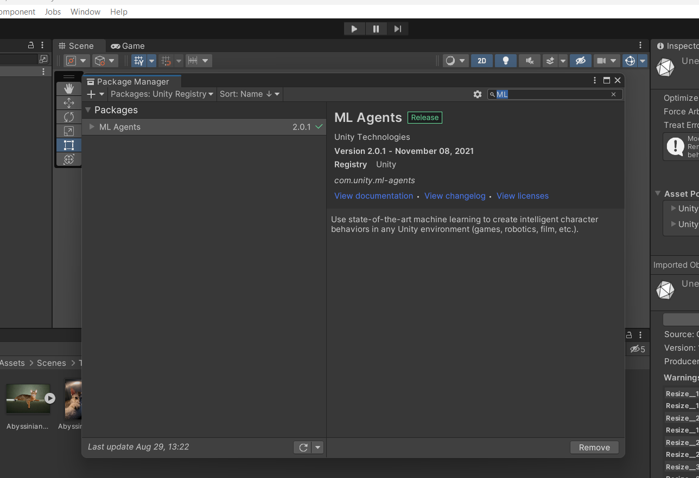

Dodajemy skrypt do obiekty sceny.

```cs

using UnityEngine;
using Unity.Barracuda;
using UnityEngine.UI;

public class CatsDogsONNX : MonoBehaviour
{
    public NNModel onnxAsset;
    public Texture2D imageToRecognise;
    private IWorker worker;
    void Start()
    {
        // stworzenie workera do obsługi modelu
        worker = onnxAsset.CreateWorker();
    } 

    void Update()
    {
        ProcessData();
    }

    private void ProcessData()
    {
        // zmiana rozmiaru tekstury zgodnie z rozmiarem wejściowym sieci
        imageToRecognise = Resize(imageToRecognise, 150, 150);
        using (var input = new Tensor(imageToRecognise, channels: 3))
        {
            // przetworzenie danych przez sieć neuronową oraz zwrócenie wyników
            var output = worker.Execute(input).PeekOutput();
            // poniższa linia odwołuje się do wynikowego tensora (instrukcja blokująca do momentu aż sieć nie skończy obliczeń)
            var indexWithHighestProbability = output[0];
            UnityEngine.Debug.Log("Wyniki klasyfikacji: " + output[0] + " " + output[1]);
        }
    }
    Texture2D Resize(Texture2D texture2D,int targetX,int targetY)
    {
        RenderTexture rt=new RenderTexture(targetX, targetY,24);
        RenderTexture.active = rt;
        Graphics.Blit(texture2D,rt);
        Texture2D result=new Texture2D(targetX,targetY);
        result.ReadPixels(new Rect(0,0,targetX,targetY),0,0);
        result.Apply();
        return result;
    }

}


```

Do projektu dodajemy również plik saved_model_cats_dogs.onnx oraz przykładowy obraz do klasyfikacji. Po uruchomieniu możemy zobaczyć, z jaką szybkością działa przetwarzanie danych (dla komputera na którym były robione testy około 75 fps).

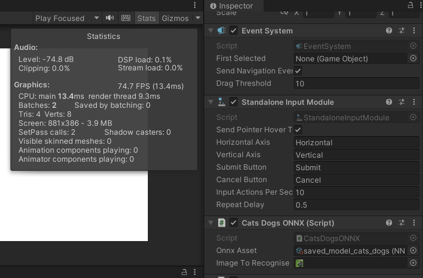

### B. Przykład 2: koder-dekoder z połączeniami residualnymi

Poniższa sieć U-NET dokonuje segmentacji obrazów kotów. Na wejściu sieć pobiera obraz przedstawiający zwierzę a zwraca trójwymiarową mapę z anotacjami: tła obrazka, krawędzi obiektu oraz wnętrza obiektu.

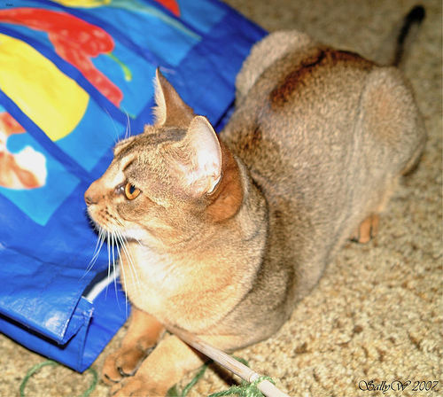
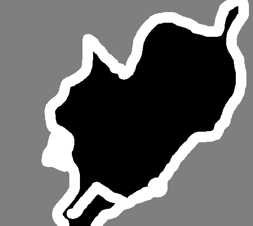

W pierwszym kroku tworzymy sieć o architekturze koder-dekoder, którą trenujemy. Po wytrenowaniu zapisujemy ją do zip-a. 

```cs

# Źródło kodu: https://keras.io/examples/vision/oxford_pets_image_segmentation/
import os
# Źródło danych
input_dir = "c:/data/dane_do_segmentacji/images/"
target_dir = "c:/data/dane_do_segmentacji/annotations/trimaps/"
img_size = (160, 160)
num_classes = 3
batch_size = 32

# Dane treningowe (obrazy)
input_img_paths = sorted(
    [
        os.path.join(input_dir, fname)
        for fname in os.listdir(input_dir)
        if fname.endswith(".jpg")
    ]
)

# Dane treningowe (anotacje)
target_img_paths = sorted(
    [
        os.path.join(target_dir, fname)
        for fname in os.listdir(target_dir)
        if fname.endswith(".png") and not fname.startswith(".")
    ]
)

print("Number of samples:", len(input_img_paths))

for input_path, target_path in zip(input_img_paths[:10], target_img_paths[:10]):
    print(input_path, "|", target_path)


import keras
import numpy as np
from tensorflow import data as tf_data
from tensorflow import image as tf_image
from tensorflow import io as tf_io


def get_dataset(
    batch_size,
    img_size,
    input_img_paths,
    target_img_paths,
    max_dataset_len=None,
):
    # Metoda zwraca obraz oraz jego anotację, zwróć uwagę, że obrazki nie są skalowane do 0-1,
    # będzie to mieć znaczenie przy używaniu sieci w Unity
    def load_img_masks(input_img_path, target_img_path):
        input_img = tf_io.read_file(input_img_path)
        input_img = tf_io.decode_png(input_img, channels=3)
        input_img = tf_image.resize(input_img, img_size)
        input_img = tf_image.convert_image_dtype(input_img, "float32")

        target_img = tf_io.read_file(target_img_path)
        target_img = tf_io.decode_png(target_img, channels=1)
        target_img = tf_image.resize(target_img, img_size, method="nearest")
        target_img = tf_image.convert_image_dtype(target_img, "uint8")

        # Etykiety to 1, 2, 3. Odejmujemy jeden, aby otrzymać 0, 1, 2
        target_img -= 1
        return input_img, target_img

    # Jesli chcemy możemy ograniczyć zbióra danych na potrzeby debugowania
    if max_dataset_len:
        input_img_paths = input_img_paths[:max_dataset_len]
        target_img_paths = target_img_paths[:max_dataset_len]
    dataset = tf_data.Dataset.from_tensor_slices((input_img_paths, target_img_paths))
    dataset = dataset.map(load_img_masks, num_parallel_calls=tf_data.AUTOTUNE)
    return dataset.batch(batch_size)


from keras import layers

# Konstrukcja kodera-dekodera
def get_model(img_size, num_classes):
    inputs = keras.Input(shape=img_size + (3,))


    # Downsampling

    # Blok wejsciowy
    x = layers.Conv2D(32, 3, strides=2, padding="same")(inputs)
    x = layers.BatchNormalization()(x)
    x = layers.Activation("relu")(x)

    previous_block_activation = x  # residuum

    # Bloki 1, 2, 3 mają taką samą strukturę, ale inną liczbę neuronów
    for filters in [64, 128, 256]:
        x = layers.Activation("relu")(x)
        x = layers.SeparableConv2D(filters, 3, padding="same")(x)
        x = layers.BatchNormalization()(x)

        x = layers.Activation("relu")(x)
        x = layers.SeparableConv2D(filters, 3, padding="same")(x)
        x = layers.BatchNormalization()(x)

        x = layers.MaxPooling2D(3, strides=2, padding="same")(x)

        # dodanie residuum
        residual = layers.Conv2D(filters, 1, strides=2, padding="same")(
            previous_block_activation
        )
        x = layers.add([x, residual])
        previous_block_activation = x

    # upsampling

    for filters in [256, 128, 64, 32]:
        x = layers.Activation("relu")(x)
        x = layers.Conv2DTranspose(filters, 3, padding="same")(x)
        x = layers.BatchNormalization()(x)

        x = layers.Activation("relu")(x)
        x = layers.Conv2DTranspose(filters, 3, padding="same")(x)
        x = layers.BatchNormalization()(x)

        x = layers.UpSampling2D(2)(x)

        # dodanie residuum
        residual = layers.UpSampling2D(2)(previous_block_activation)
        residual = layers.Conv2D(filters, 1, padding="same")(residual)
        x = layers.add([x, residual])  # Add back residual
        previous_block_activation = x  # Set aside next residual

    # Warstwa wyjsciowa dokonująca klasyfikacji poszczególnych pikseli
    outputs = layers.Conv2D(num_classes, 3, activation="softmax", padding="same")(x)

    model = keras.Model(inputs, outputs)
    return model


# Tworzenie modelu
model = get_model(img_size, num_classes)
model.summary()

import random

# Podzielenie zbioru na częsć treningową i walidacyjną
val_samples = 1000
random.Random(1337).shuffle(input_img_paths)
random.Random(1337).shuffle(target_img_paths)
train_input_img_paths = input_img_paths[:-val_samples]
train_target_img_paths = target_img_paths[:-val_samples]
val_input_img_paths = input_img_paths[-val_samples:]
val_target_img_paths = target_img_paths[-val_samples:]

# W celu przyspiszenia treningu używamy 1000 obiektów
train_dataset = get_dataset(
    batch_size,
    img_size,
    train_input_img_paths,
    train_target_img_paths,
    max_dataset_len=1000,# usuń, jesli chcesz trenować na całym zbiorze danych
)
valid_dataset = get_dataset(
    batch_size, img_size, val_input_img_paths, val_target_img_paths
)

##################################################################

# Jeśli dane docelowe są już zakodowane jako one-hot bit (np. 100, 010, 001),
# używamy categorical_crossentropy. Jeśli dane docelowe są reprezentowane jako liczby całkowite (indeksy klas)
# używamy sparse_categorical_crossentropy.
model.compile(
    optimizer=keras.optimizers.Adam(1e-4), loss="sparse_categorical_crossentropy"
)

callbacks = [
    keras.callbacks.ModelCheckpoint("unet_segmentation.keras", save_best_only=True)
]

# Trening modelu
epochs = 50
model.fit(
    train_dataset,
    epochs=epochs,
    validation_data=valid_dataset,
    callbacks=callbacks,
    verbose=2,
)

# Zapis do archiwum zip
import os
save_model_path="unet_segmentation_saved_model"
if not os.path.isdir(save_model_path):
      os.makedirs(save_model_path)

model.save(save_model_path)

import shutil
shutil.make_archive(save_model_path, 'zip', save_model_path)

```

Podobnie jak w wypadku sieci z poprzedniego przykładu, zip przesyłamy na Google Colab i konwertujemy do formatu ONNX. Sieć w formacie ONNX pobieramy.

```cs

# Instalacja zależności
!pip install onnxruntime
!pip install onnx
!pip install -U tf2onnx

!unzip unet_segmentation_saved_model.zip -d unet_segmentation_saved_model
!python -m tf2onnx.convert --saved-model /content/unet_segmentation_saved_model --opset 11 --output unet_segmentation_saved_model.onnx


```

Testujemy w Python, czy model działa prawidłowo.

```cs

import numpy as np
from PIL import Image
import onnxruntime as ort
onnx_path = 'unet_segmentation_saved_model.onnx'
img_size = (160, 160)


img = Image.open("c:/data/dane_do_segmentacji/images/Abyssinian_1.jpg").convert('RGB').resize((160,160))
input_img=np.expand_dims(np.asarray(img, dtype="float32"),axis=0)

from PIL import ImageOps
import cv2
import keras

def display_mask(val_preds):
    """Quick utility to display a model's prediction."""
    mask = np.argmax(val_preds, axis=-1)
    mask = np.expand_dims(mask, axis=-1)
    img = ImageOps.autocontrast(keras.utils.array_to_img(mask))
    img = np.array(img)
    cv2.imshow('a', img)
    cv2.waitKey()

def display_mask2(val_preds):
    cv2.imshow('a', val_preds)
    cv2.waitKey()

sess_ort = ort.InferenceSession(onnx_path,providers=ort.get_available_providers())

outputs = sess_ort.run(None, {sess_ort.get_inputs()[0].name: input_img})
outputs = outputs[0]
display_mask2(outputs[0])

```

Używamy sieci w Unity. Konfiguracja projekty jest analogiczna jak w poprzednim przykładzie. Wynik segmentacji wyrysowujemy np. na obiekcie Canvas, który ma obiekt Raw Image.

```cs

using UnityEngine;
using Unity.Barracuda;
using UnityEngine.UI;

public class UNetScript : MonoBehaviour
{
    public NNModel onnxAsset;
    public Texture2D imageToRecognise;
    private IWorker worker;
    public RawImage rawImage;
    
    void Start()
    {
        worker = onnxAsset.CreateWorker();
    } 

    void Update()
    {
        Process();
    }

    private void Process()
    {
        imageToRecognise = Resize(imageToRecognise, 160, 160);
        using (var input = new Tensor(imageToRecognise, channels: 3))
        {
        TensorShape ts = input.shape;
        Tensor part2 = new Tensor(ts);
        // Sieć została wytrenowana na obrazach o wartościach kolorów z przedziałów
        // [0-255], dlatego również tu musimy podać takie wartości. Tekstury mają
        // domyślnie wartości kolorów zeskalowane do [0-1].
        for (int y = 0; y < input.width; y++) {
            for (int x = 0; x < input.height; x++) {              
                float r = input[0,y,x,0] * 255.0f;
                float g = input[0,y,x,1] * 255.0f;
                float b = input[0,y,x,2] * 255.0f;
                part2[0,y,x,0] =  r;
                part2[0,y,x,1] =  g;
                part2[0,y,x,2] =  b;
            }
        }
        var output = worker.Execute(part2).PeekOutput();
        var texture = BarracudaTextureUtils.TensorToRenderTexture(output);
        UnityEngine.Debug.Log(output.length);
        // Wyświetlenie obrazka
        rawImage.texture = texture;
        }
    }

    Texture2D Resize(Texture2D texture2D,int targetX,int targetY)
    {
        RenderTexture rt=new RenderTexture(targetX, targetY,24);
        RenderTexture.active = rt;
        Graphics.Blit(texture2D,rt);
        Texture2D result=new Texture2D(targetX,targetY);
        result.ReadPixels(new Rect(0,0,targetX,targetY),0,0);
        result.Apply();
        return result;
    }
}


```

Sieć w Unity osiąga około 60 fps.

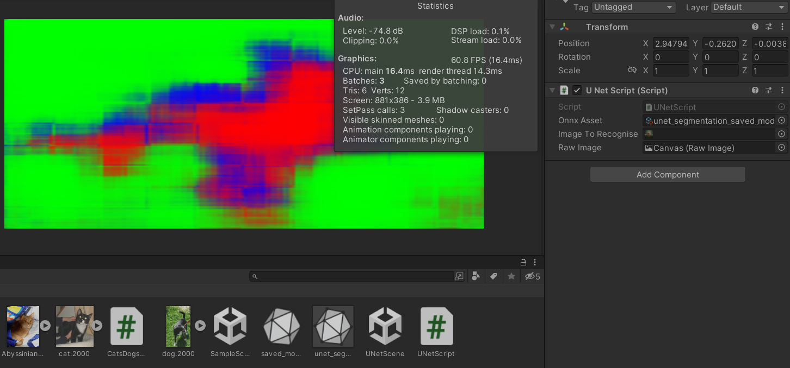


## 4. Klasyfikacja szeregów czasowych przy pomocy sieci neuronowych

Tą sekcję opracowano na podstawie [link](https://machinelearningmastery.com/how-to-develop-rnn-models-for-human-activity-recognition-time-series-classification/).

Przetestujemy działanie różnych architektur sieci neurnowych na zbiorze danych 
[link](https://archive.ics.uci.edu/dataset/240/human+activity+recognition+using+smartphones). Zbiór zawiera dane pochodzące od 30 osób. Każda osoba wykonywała sześć czynności (WALKING, WALKING_UPSTAIRS, WALKING_DOWNSTAIRS, SITTING, STANDING, LAYING), mając na sobie smartfon (Samsung Galaxy S II) przewieszony w pasie. Korzystając z wbudowanego akcelerometru i żyroskopu, zarejestrowaliśmy 3-osiowe przyspieszenie liniowe i 3-osiową prędkość kątową przy stałej częstotliwości 50 Hz.

### A. Warstwa Long Short Term Memory (LSTM) oraz Warstwa Gated Recurrent Unit (GRU)

Niniejszą sekcję opracowano na podstawie [link](https://www.cs.put.poznan.pl/alawrynowicz/PJN_5-2020.pdf).

<!-- https://medium.com/analytics-vidhya/lstms-explained-a-complete-technically-accurate-conceptual-guide-with-keras-2a650327e8f2 -->


Mówiąc najogólniej, LSTM ma dwa wyjścia: stan komórki (cell state) na górze i stan ukryty (hidden state) na dole. GRU ma tylko jedno wyjście, stan ukryty.

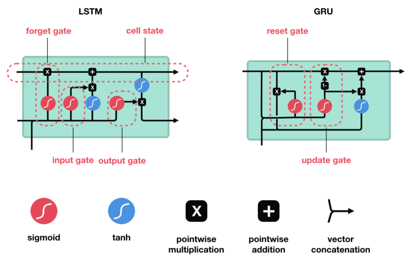

Źródło rysunku [link](https://tiewkh.github.io/blog/gru-hidden-state/).

W komórce LSTM bieżący wektor wejściowy x(t) i poprzedni stan krótkoterminowy h(t−1) są podawane do czterech różnych, w pełni połączonych
warstw: jednej warstwy głównej oraz trzech warstwy kontrolerów bramkowych.

- Warstwa główna
    - ma na wyjściu c(t)
    - pełni rolę w analizie bieżących wejść c(t) i poprzedniego  (krótkoterminowego) stanu h(t−1)
    - w podstawowej komórce nie ma nic więcej oprócz tej warstwy, a jej wynik idzie prosto do y(t) i h(t)
    - w komórce LSTM wynik tej warstwy jest częściowo przechowywany w stanie długoterminowym
- Kontrolery bramkowe używają logistycznej funkcji aktywacji, więc ich wyjścia są w zakresie od 0 do 1 (ich wyjścia są podawane do operacji mnożenia: jeśli wynikiem są 0, zamykają bramkę, a jeśli 1, to otwierają bramkę).
    - Bramka "zapomnij" (sterowana przez f (t)) kontroluje, które części
stanu długoterminowego powinny zostać usunięte.
    - Bramka wejściowa (sterowana przez i(t)) kontroluje, które części
g(t) powinny być dodane do stanu długoterminowego.
    - Bramka wyjściowa (sterowana przez o(t)) kontroluje, które części
stanu długoterminowego powinny być odczytywane i wyprowadzane w danym momencie (zarówno do h(t), jak i y(t)).

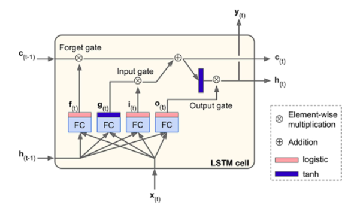

Źródło rysunku [link](https://www.cs.put.poznan.pl/alawrynowicz/PJN_5-2020.pdf).

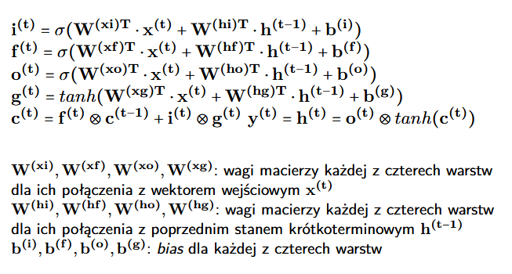

Źródło rysunku [link](https://www.cs.put.poznan.pl/alawrynowicz/PJN_5-2020.pdf).

<!-- [xxxx](https://machinelearningmastery.com/return-sequences-and-return-states-for-lstms-in-keras/) -->

W komórce GRU est uproszczoną wersją LSTM. Oba wektory stanu są połączone w pojedynczy wektor h(t) a pojedynczy kontroler bramkowy kontroluje zarówno bramkę ”zapomnij”, jak i bramkę wejściową. Jeśli kontroler bramki wyświetli wartość 1, bramka wejściowa jest otwarta, a bramka "zapomnij" jest zamknięta. Jeśli wynik wynosi 0, dzieje się odwrotnie innymi słowy, kiedy pamięć musi być przechowywana, miejsce, w którym ma być zapisana, jest najpierw usuwane. Nie ma bramki wyjściowej; pełen wektor stanu wyprowadzany jest za każdym razem. Istnieje jednak nowy kontroler bramki,
który kontroluje, która część poprzedniego stanu zostanie
pokazana głównej warstwie.

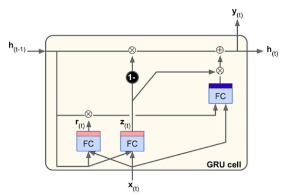

Źródło rysunku [link](https://www.cs.put.poznan.pl/alawrynowicz/PJN_5-2020.pdf).

- Bramka "aktualizuj" (sterowana przez z(t)) pomaga określić, ile
wcześniejszych informacji (z poprzednich kroków czasowych) należy przekazać do ”przyszłości”.
- Bramka "resetuj" (sterowana przez r(t)) kontroluje ile informacji z
przeszłości ”zapomieć”.

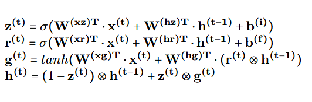

Źródło rysunku [link](https://www.cs.put.poznan.pl/alawrynowicz/PJN_5-2020.pdf).

<!--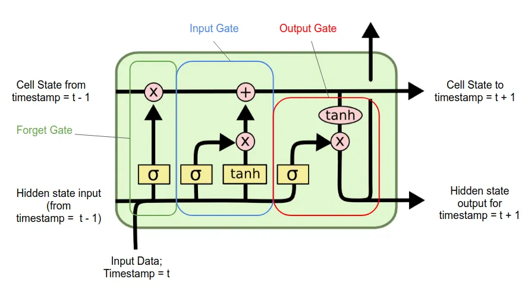

https://medium.com/analytics-vidhya/lstms-explained-a-complete-technically-accurate-conceptual-guide-with-keras-2a650327e8f2

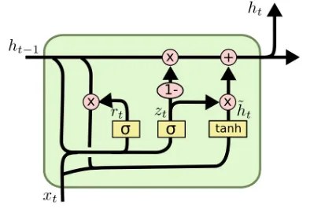

https://kinder-chen.medium.com/introduction-to-lstm-and-gru-2fe6f50e3ef2

https://stackoverflow.com/questions/55261557/understanding-gru-architecture-keras

https://en.wikipedia.org/w/index.php?title=Gated_recurrent_unit&oldid=883963113 -->


### B. Implementacja klasyfikacji

Kod trenujący różne typy sieci:

```python

# https://machinelearningmastery.com/how-to-develop-rnn-models-for-human-activity-recognition-time-series-classification/
# https://archive.ics.uci.edu/dataset/240/human+activity+recognition+using+smartphones

from numpy import mean
from numpy import std
from numpy import dstack
from pandas import read_csv
from keras.models import Sequential
from keras.layers import Dense
from keras.layers import Flatten
from keras.layers import Dropout
from keras.layers import LSTM
from keras.utils import to_categorical
import keras
from matplotlib import pyplot
import shutil


# load a single file as a numpy array
def load_file(filepath):
    # dataframe = read_csv(filepath, header=None, delim_whitespace=True)
    dataframe = read_csv(filepath, header=None, sep='\s+')
    return dataframe.values


# load a list of files and return as a 3d numpy array
def load_group(filenames, prefix=''):
    loaded = list()
    for name in filenames:
        data = load_file(prefix + name)
        loaded.append(data)
    # stack group so that features are the 3rd dimension
    loaded = dstack(loaded)
    return loaded


# load a dataset group, such as train or test
def load_dataset_group(group, prefix=''):
    filepath = prefix + group + '/Inertial Signals/'
    # load all 9 files as a single array
    filenames = list()
    # total acceleration
    filenames += ['total_acc_x_' + group + '.txt', 'total_acc_y_' + group + '.txt', 'total_acc_z_' + group + '.txt']
    # body acceleration
    filenames += ['body_acc_x_' + group + '.txt', 'body_acc_y_' + group + '.txt', 'body_acc_z_' + group + '.txt']
    # body gyroscope
    filenames += ['body_gyro_x_' + group + '.txt', 'body_gyro_y_' + group + '.txt', 'body_gyro_z_' + group + '.txt']
    # load input data
    X = load_group(filenames, filepath)
    # load class output
    y = load_file(prefix + group + '/y_' + group + '.txt')
    return X, y


# load the dataset, returns train and test X and y elements
def load_dataset(prefix=''):
    # load all train
    trainX, trainy = load_dataset_group('train', 'c:\\data\\UCI HAR Dataset\\UCI HAR Dataset\\')
    print(trainX.shape, trainy.shape)
    # load all test
    testX, testy = load_dataset_group('test', 'c:\\data\\UCI HAR Dataset\\UCI HAR Dataset\\')
    print(testX.shape, testy.shape)
    # zero-offset class values
    trainy = trainy - 1
    testy = testy - 1
    # one hot encode y
    trainy = to_categorical(trainy)
    testy = to_categorical(testy)
    print(trainX.shape, trainy.shape, testX.shape, testy.shape)
    return trainX, trainy, testX, testy


# fit and evaluate a model
def evaluate_model_LSTM(trainX, trainy, testX, testy, save_file_name = None):
    verbose, epochs, batch_size = 0, 15, 64
    n_timesteps, n_features, n_outputs = trainX.shape[1], trainX.shape[2], trainy.shape[1]
    model = Sequential()
    model.add(LSTM(100, input_shape=(n_timesteps, n_features)))
    model.add(Dropout(0.5))
    model.add(Dense(100, activation='relu'))
    model.add(Dense(n_outputs, activation='softmax'))
    model.compile(loss='categorical_crossentropy', optimizer='adam', metrics=['accuracy'])
    # fit network
    model.fit(trainX, trainy, epochs=epochs, batch_size=batch_size, verbose=verbose)
    # evaluate model
    _, accuracy = model.evaluate(testX, testy, batch_size=batch_size, verbose=0)

    if save_file_name is not None:
        save_model_path = save_file_name
        model.save(save_model_path)
        shutil.make_archive(save_model_path, 'zip', save_model_path)
    return accuracy

def evaluate_model_Dense(trainX, trainy, testX, testy, save_file_name = None):
    verbose, epochs, batch_size = 0, 15, 64
    n_timesteps, n_features, n_outputs = trainX.shape[1], trainX.shape[2], trainy.shape[1]
    model = Sequential()
    model.add(keras.layers.Flatten())
    model.add(Dense(100, activation='relu'))
    model.add(Dropout(0.5))
    model.add(Dense(100, activation='relu'))
    model.add(Dense(n_outputs, activation='softmax'))
    model.compile(loss='categorical_crossentropy', optimizer='adam', metrics=['accuracy'])
    # fit network
    model.fit(trainX, trainy, epochs=epochs, batch_size=batch_size, verbose=verbose)
    # evaluate model
    _, accuracy = model.evaluate(testX, testy, batch_size=batch_size, verbose=0)
    if save_file_name is not None:
        save_model_path = save_file_name
        model.save(save_model_path)
        shutil.make_archive(save_model_path, 'zip', save_model_path)

    return accuracy

def evaluate_model_Conv1D(trainX, trainy, testX, testy, save_file_name = None):
    verbose, epochs, batch_size = 0, 15, 64
    n_timesteps, n_features, n_outputs = trainX.shape[1], trainX.shape[2], trainy.shape[1]
    model = Sequential()

    model.add(keras.layers.Conv1D(32, 3, activation='relu'))
    model.add(keras.layers.Flatten())
    model.add(Dropout(0.5))
    model.add(Dense(100, activation='relu'))
    model.add(Dense(n_outputs, activation='softmax'))
    model.compile(loss='categorical_crossentropy', optimizer='adam', metrics=['accuracy'])
    # fit network
    model.fit(trainX, trainy, epochs=epochs, batch_size=batch_size, verbose=verbose)
    # evaluate model
    _, accuracy = model.evaluate(testX, testy, batch_size=batch_size, verbose=0)
    if save_file_name is not None:
        save_model_path = save_file_name
        model.save(save_model_path)
        shutil.make_archive(save_model_path, 'zip', save_model_path)
    return accuracy

def evaluate_model_GRU(trainX, trainy, testX, testy, save_file_name = None):
    verbose, epochs, batch_size = 0, 15, 64
    n_timesteps, n_features, n_outputs = trainX.shape[1], trainX.shape[2], trainy.shape[1]
    model = Sequential()
    model.add(keras.layers.GRU(100, return_sequences=True))
    model.add(keras.layers.GRU(100))

    model.add(Dropout(0.5))
    model.add(Dense(100, activation='relu'))
    model.add(Dense(n_outputs, activation='softmax'))
    model.compile(loss='categorical_crossentropy', optimizer='adam', metrics=['accuracy'])
    # fit network
    model.fit(trainX, trainy, epochs=epochs, batch_size=batch_size, verbose=verbose)
    # evaluate model
    _, accuracy = model.evaluate(testX, testy, batch_size=batch_size, verbose=0)

    if save_file_name is not None:
        save_model_path = save_file_name
        model.save(save_model_path)
        shutil.make_archive(save_model_path, 'zip', save_model_path)

    return accuracy

def evaluate_model_small(trainX, trainy, testX, testy, save_file_name = None):
    verbose, epochs, batch_size = 0, 15, 64
    n_timesteps, n_features, n_outputs = trainX.shape[1], trainX.shape[2], trainy.shape[1]
    model = Sequential()
    model.add(keras.layers.Flatten())
    model.add(Dense(100, activation='relu'))
    model.add(Dense(n_outputs, activation='softmax'))
    model.compile(loss='categorical_crossentropy', optimizer='adam', metrics=['accuracy'])
    # fit network
    model.fit(trainX, trainy, epochs=epochs, batch_size=batch_size, verbose=verbose)
    # evaluate model
    _, accuracy = model.evaluate(testX, testy, batch_size=batch_size, verbose=0)

    if save_file_name is not None:
        save_model_path = save_file_name
        model.save(save_model_path)
        shutil.make_archive(save_model_path, 'zip', save_model_path)

    return accuracy


# summarize scores
def summarize_results(scores):
    print(scores)
    m, s = mean(scores), std(scores)
    print('Accuracy: %.3f%% (+/-%.3f)' % (m, s))


# run an experiment
def run_experiment(repeats=10):
    # load data
    trainX, trainy, testX, testy = load_dataset()
    # repeat experiment
    scores_GRU = list()
    scores_small = list()
    scores_Dense = list()
    scores_LSTM = list()
    scores_Conv1D = list()
    for r in range(repeats):
        print(r)
        score = evaluate_model_GRU(trainX, trainy, testX, testy, 'gru')
        scores_GRU.append(score)
        score = evaluate_model_small(trainX, trainy, testX, testy, 'small')
        scores_small.append(score)
        score = evaluate_model_Dense(trainX, trainy, testX, testy, 'dense')
        scores_Dense.append(score)
        score = evaluate_model_LSTM(trainX, trainy, testX, testy, 'lstm')
        scores_LSTM.append(score)
        score = evaluate_model_Conv1D(trainX, trainy, testX, testy, 'conv1d')
        scores_Conv1D.append(score)

    # summarize results
    summarize_results(scores_GRU)
    summarize_results(scores_small)
    summarize_results(scores_Dense)
    summarize_results(scores_LSTM)
    summarize_results(scores_Conv1D)

# run the experiment
run_experiment()


```


Aby przekształcić modele na onnx na colab wykonujemy następujący kod:

```py

# Instalacja zależności
!pip install onnxruntime
!pip install onnx
!pip install -U tf2onnx

!unzip gru.zip -d gru
!python -m tf2onnx.convert --saved-model /content/gru --opset 11 --output gru.onnx

!unzip small.zip -d small
!python -m tf2onnx.convert --saved-model /content/small --opset 11 --output small.onnx

!unzip dense.zip -d dense
!python -m tf2onnx.convert --saved-model /content/dense --opset 11 --output dense.onnx

!unzip lstm.zip -d lstm
!python -m tf2onnx.convert --saved-model /content/lstm --opset 11 --output lstm.onnx

!unzip conv1d.zip -d conv1d
!python -m tf2onnx.convert --saved-model /content/conv1d --opset 11 --output conv1d.onnx

```

Testowanie, czy sieci w keras i onnx zwracają takie same rezultaty:

```python

import onnxruntime as ort
from numpy import dstack
from pandas import read_csv
from keras.utils import to_categorical
import keras
import numpy as np

# load a single file as a numpy array
def load_file(filepath):
    # dataframe = read_csv(filepath, header=None, delim_whitespace=True)
    dataframe = read_csv(filepath, header=None, sep='\s+')
    return dataframe.values


# load a list of files and return as a 3d numpy array
def load_group(filenames, prefix=''):
    loaded = list()
    for name in filenames:
        data = load_file(prefix + name)
        loaded.append(data)
    # stack group so that features are the 3rd dimension
    loaded = dstack(loaded)
    return loaded


# load a dataset group, such as train or test
def load_dataset_group(group, prefix=''):
    filepath = prefix + group + '/Inertial Signals/'
    # load all 9 files as a single array
    filenames = list()
    # total acceleration
    filenames += ['total_acc_x_' + group + '.txt', 'total_acc_y_' + group + '.txt', 'total_acc_z_' + group + '.txt']
    # body acceleration
    filenames += ['body_acc_x_' + group + '.txt', 'body_acc_y_' + group + '.txt', 'body_acc_z_' + group + '.txt']
    # body gyroscope
    filenames += ['body_gyro_x_' + group + '.txt', 'body_gyro_y_' + group + '.txt', 'body_gyro_z_' + group + '.txt']
    # load input data
    X = load_group(filenames, filepath)
    # load class output
    y = load_file(prefix + group + '/y_' + group + '.txt')
    return X, y

# load the dataset, returns train and test X and y elements
def load_dataset(prefix=''):
    # load all train
    # trainX, trainy = load_dataset_group('train', prefix + 'HARDataset/')
    trainX, trainy = load_dataset_group('train', 'c:\\data\\UCI HAR Dataset\\UCI HAR Dataset\\')
    print(trainX.shape, trainy.shape)
    # load all test
    # testX, testy = load_dataset_group('test', prefix + 'HARDataset/')
    testX, testy = load_dataset_group('test', 'c:\\data\\UCI HAR Dataset\\UCI HAR Dataset\\')
    print(testX.shape, testy.shape)
    # zero-offset class values
    trainy = trainy - 1
    testy = testy - 1
    # one hot encode y
    trainy = to_categorical(trainy)
    testy = to_categorical(testy)
    print(trainX.shape, trainy.shape, testX.shape, testy.shape)
    return trainX, trainy, testX, testy

def test_onnx_and_model(onnx_path, model_path, trainX, trainy, testX, testy):
    sess_ort = ort.InferenceSession(onnx_path,providers=ort.get_available_providers())
    xx = np.expand_dims(np.asarray(testX[0], dtype="float32"),axis=0)
    outputs = sess_ort.run(None, {sess_ort.get_inputs()[0].name: xx})
    outputs = outputs[0]

    model = keras.models.load_model(model_path)
    xx = np.expand_dims(testX[0],axis=0)
    vv = model(xx)
    print(vv)
    print(outputs)

print('gru')
trainX, trainy, testX, testy = load_dataset()

test_onnx_and_model('onnx/gru.onnx', 'gru', trainX, trainy, testX, testy)

print('conv1d')
test_onnx_and_model('onnx/conv1d.onnx', 'conv1d', trainX, trainy, testX, testy)

print('dense')
test_onnx_and_model('onnx/dense.onnx', 'dense', trainX, trainy, testX, testy)

print('lstm')
test_onnx_and_model('onnx/lstm.onnx', 'lstm', trainX, trainy, testX, testy)

print('small')
test_onnx_and_model('onnx/small.onnx', 'small', trainX, trainy, testX, testy)


```

Testujemy sieć w Unity. Niestety, nie wszystkie modele które udały się uruchomić w tensorflow będą działały w Unity :-( W momencie pisania tego wykładu LSTM oraz GRU nie są w prawidłowym formacie a Conv1 zwraca błędy przy wykonaniu.

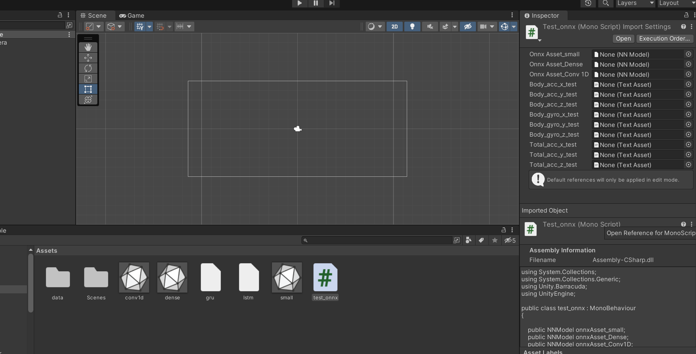


```c#

using System.Collections;
using System.Collections.Generic;
using Unity.Barracuda;
using UnityEngine;

public class test_onnx : MonoBehaviour
{

    public NNModel onnxAsset_small;
    public NNModel onnxAsset_Dense;
    public NNModel onnxAsset_Conv1D;

    private IWorker worker_small;
    private IWorker worker_Dense;
    private IWorker worker_Conv1D;

    public TextAsset body_acc_x_test;
    public TextAsset body_acc_y_test;
    public TextAsset body_acc_z_test;
    public TextAsset body_gyro_x_test;
    public TextAsset body_gyro_y_test;
    public TextAsset body_gyro_z_test;
    public TextAsset total_acc_x_test;
    public TextAsset total_acc_y_test;
    public TextAsset total_acc_z_test;

    List<float[]> body_acc_x_test_list = new List<float[]>();
    List<float[]> body_acc_y_test_list = new List<float[]>();
    List<float[]> body_acc_z_test_list = new List<float[]>();
    List<float[]> body_gyro_x_test_list = new List<float[]>();
    List<float[]> body_gyro_y_test_list = new List<float[]>();
    List<float[]> body_gyro_z_test_list = new List<float[]>();
    List<float[]> total_acc_x_test_list = new List<float[]>();
    List<float[]> total_acc_y_test_list = new List<float[]>();
    List<float[]> total_acc_z_test_list = new List<float[]>();

    void Start()
    {
        // stworzenie workera do obsługi modelu
        worker_small = onnxAsset_small.CreateWorker();
        worker_Dense = onnxAsset_Dense.CreateWorker();
        worker_Conv1D = onnxAsset_Conv1D.CreateWorker();

        readFloatArray(body_acc_x_test_list, body_acc_x_test.text);
        readFloatArray(body_acc_y_test_list, body_acc_y_test.text);
        readFloatArray(body_acc_z_test_list, body_acc_z_test.text);

        readFloatArray(body_gyro_x_test_list, body_gyro_x_test.text);
        readFloatArray(body_gyro_y_test_list, body_gyro_y_test.text);
        readFloatArray(body_gyro_z_test_list, body_gyro_z_test.text);

        readFloatArray(total_acc_x_test_list, total_acc_x_test.text);
        readFloatArray(total_acc_y_test_list, total_acc_y_test.text);
        readFloatArray(total_acc_z_test_list, total_acc_z_test.text);
    }

    private void readFloatArray(List<float[]> myList, string myText)
    {
        var all_lines = myText.Split('\n');
        System.Globalization.CultureInfo ci = new System.Globalization.CultureInfo("en-US");
        System.Globalization.CultureInfo old_ci = System.Threading.Thread.CurrentThread.CurrentCulture;
        System.Threading.Thread.CurrentThread.CurrentCulture = ci;
        float[] fl = null;
        for (int a = 0; a < all_lines.Length; a++)
        {
            var single_line = all_lines[a].Split(' ', System.StringSplitOptions.RemoveEmptyEntries);
            fl = new float[single_line.Length];
            for (int b = 0; b < single_line.Length; b++)
            {
                fl[b] = float.Parse(single_line[b]);
            }
            myList.Add(fl);
        }
        System.Threading.Thread.CurrentThread.CurrentCulture = old_ci;
    }

    void Update()
    {
        ProcessData();
    }

    private void ProcessData()
    {
        float[][] my_array = new float[128][];
        int c = 0;
        for (int a = 0; a < my_array.Length; a++)
        {
            my_array[a] = new float[9];
            my_array[a][0] = total_acc_x_test_list[c][a];
            my_array[a][1] = total_acc_y_test_list[c][a];
            my_array[a][2] = total_acc_z_test_list[c][a];

            my_array[a][3] = body_acc_x_test_list[c][a];
            my_array[a][4] = body_acc_y_test_list[c][a];
            my_array[a][5] = body_acc_z_test_list[c][a];
            my_array[a][6] = body_gyro_x_test_list[c][a];
            my_array[a][7] = body_gyro_y_test_list[c][a];
            my_array[a][8] = body_gyro_z_test_list[c][a];
            
        }

        // zmiana rozmiaru tekstury zgodnie z rozmiarem wejściowym sieci
        int []my_shape = { 128, 9 };
        using (var input = new Tensor(my_shape, my_array))
        {
            // przetworzenie danych przez sieć neuronową oraz zwrócenie wyników
            var output = worker_small.Execute(input).PeekOutput();
            // poniższa linia odwołuje się do wynikowego tensora (instrukcja blokująca do momentu aż sieć nie skończy obliczeń)
            float[] my_cache = { output[0], output[1], output[2], output[3], output[4], output[5] };
            UnityEngine.Debug.Log("Wyniki klasyfikacji small: " + my_cache[0] + "; " + +my_cache[1] + "; " + my_cache[2] + "; "
                                                            + my_cache[3] + "; " + my_cache[4] + "; " + my_cache[5] + "; ");

            output = worker_Dense.Execute(input).PeekOutput();
            // poniższa linia odwołuje się do wynikowego tensora (instrukcja blokująca do momentu aż sieć nie skończy obliczeń)
            float[] my_cache2 = { output[0], output[1], output[2], output[3], output[4], output[5] };
            UnityEngine.Debug.Log("Wyniki klasyfikacji dense: " + my_cache2[0] + "; " + +my_cache2[1] + "; " + my_cache2[2] + "; "
                                                            + my_cache2[3] + "; " + my_cache2[4] + "; " + my_cache2[5] + "; ");


            output = worker_Conv1D.Execute(input).PeekOutput();
            // poniższa linia odwołuje się do wynikowego tensora (instrukcja blokująca do momentu aż sieć nie skończy obliczeń)
            float[] my_cache3 = { output[0], output[1], output[2], output[3], output[4], output[5] };
            UnityEngine.Debug.Log("Wyniki klasyfikacji Conv1D: " + my_cache3[0] + "; " + +my_cache3[1] + "; " + my_cache3[2] + "; "
                                                            + my_cache3[3] + "; " + my_cache3[4] + "; " + my_cache3[5] + "; ");
        }
    }
}

````


## Literatura

[Strona ONNX](https://onnx.ai)

[Strona Barracuda](https://docs.unity3d.com/Packages/com.unity.barracuda%401.0/manual/index.html)

[Barracuda - wspierane architektury](https://docs.unity3d.com/Packages/com.unity.barracuda%401.0/manual/SupportedArchitectures.html)

[Sieć Tensorflow/Keras dokonująca segmentacji](https://keras.io/examples/vision/oxford_pets_image_segmentation/)

[Klasyfukacji aktywności ze zbioru danych nagrywanego smartfornem](https://machinelearningmastery.com/how-to-develop-rnn-models-for-human-activity-recognition-time-series-classification/).

[Zbiór danych z aktywnościami nagrywanymi smartfonem](https://archive.ics.uci.edu/dataset/240/human+activity+recognition+using+smartphones).